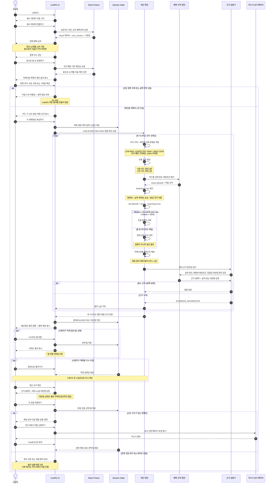

# CardFit 비즈니스 로직 시퀀스 다이어그램

> 기준: `PRD.md` v0.1 · `SRS.md` · `CALC_SPEC.md`  
> 범위: Mock 프로토타입의 온보딩부터 조합 확정·카드사 아웃링크 복귀까지

## 핵심 판정 규칙

| 지점 | 판정 |
| --- | --- |
| 미래 계획 확정 | 사용자가 화면의 전체 값을 확인하면 성립한다. 별도 30% 입력 기준은 없다 |
| 계산 기간 | 기준일로부터 12개월, 결과는 `연 n원` |
| 시나리오 | 확인한 미래 변경분만 80%·100%·120% 적용 |
| 변경 권장 | Net Benefit 5만원 이상이면서 Gross Benefit의 15% 이상 |
| 근거 | 6항목 미달이면 결과 노출 거부 |
| 미반영 상한 | 출처 있는 값만 별도 표시하며 결론 차액에는 미합산 |
| 확정·실행 | CardFit은 계산과 근거까지만 책임지고 신청·해지는 사용자가 카드사에서 직접 수행 |

## 구현 참여자 매핑

| 다이어그램 참여자 | 구현 위치 |
| --- | --- |
| CardFit UI | `src/app`, `src/components` |
| Mock Fixture | `src/fixtures` |
| Session State | `src/state` |
| 계산·혜택 규칙 엔진 | `src/domain` |
| 근거 검증기 | `src/domain` |
| 카드사 공식 페이지 | 외부 아웃링크, 신규 카드 최대 1개 |
