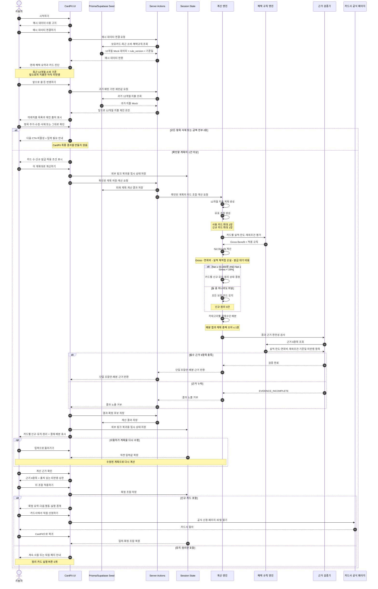

# CardFit 비즈니스 로직 시퀀스 다이어그램

> 기준: `PRD.md` v0.1 · `SRS.md` · `CALC_SPEC.md`

## 핵심 판정 규칙

| 지점 | 판정 |
| --- | --- |
| 미래 계획 확정 | 화면의 전체 값을 사용자가 확인하면 성립하며 별도 입력 비율 기준은 없음 |
| 계산 기간 | 기준일로부터 12개월, 결과는 `연 n원` |
| 조합 표시 | 카드마다 `신규·유지·정리` 중 정확히 하나의 상태 표시 |
| 변경 권장 | Net Benefit 5만원 이상이면서 Gross Benefit의 15% 이상 |
| 임계 미달 | 모든 보유 카드 `유지`, `신규·정리` 0건 |
| 근거 | 6항목 미달이면 결과 노출 거부 |
| 실행 | 신규는 카드사 링크, 정리는 안내만 제공 |
