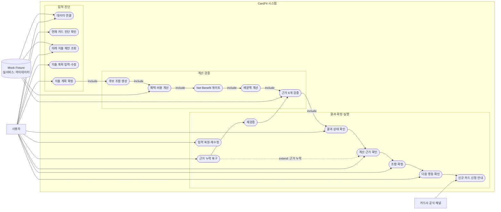
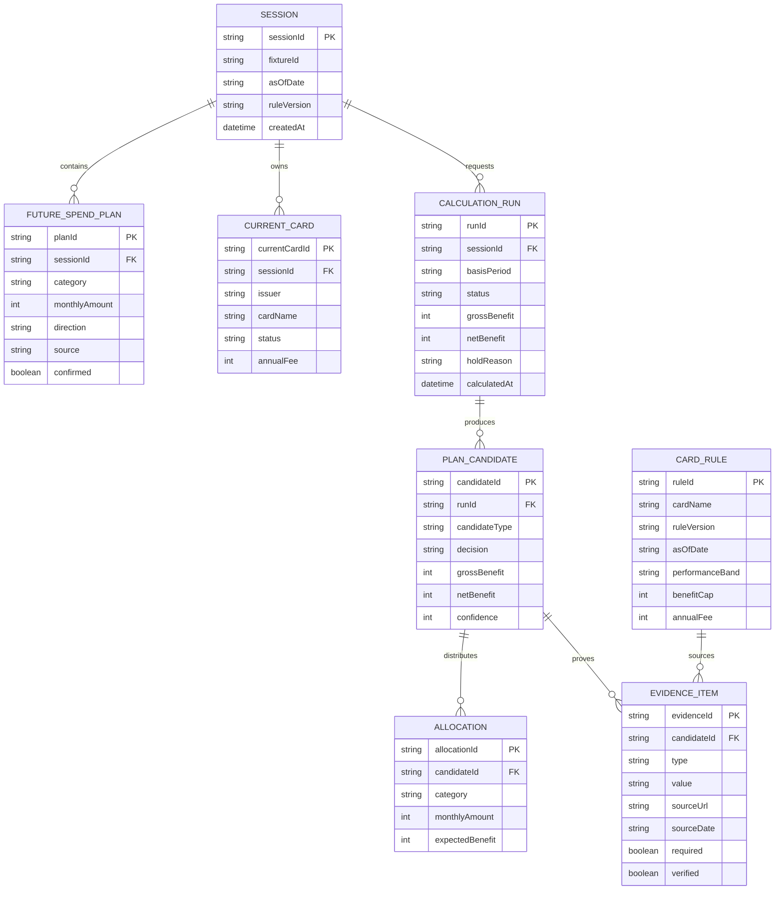
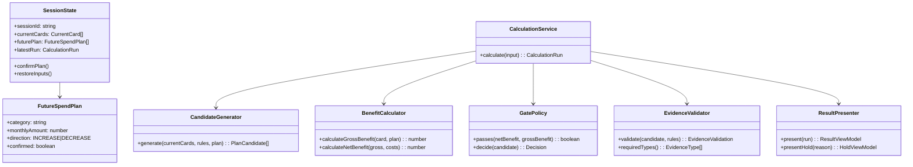
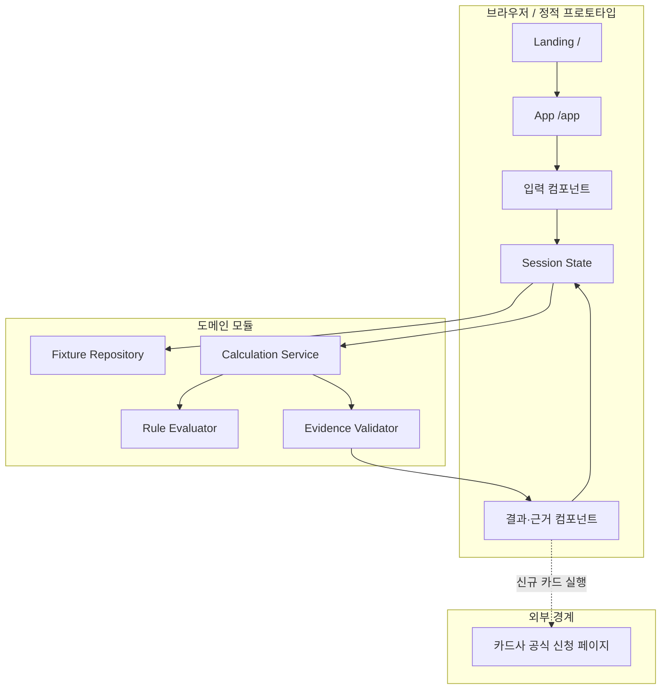
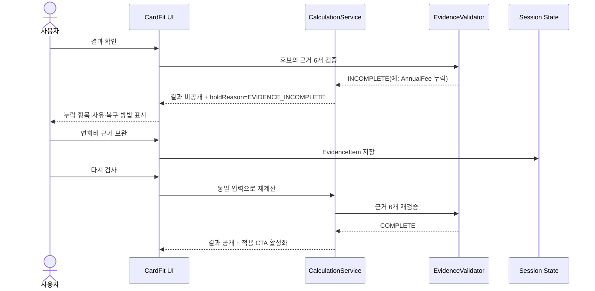
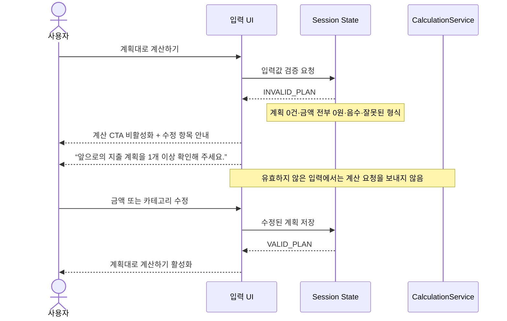
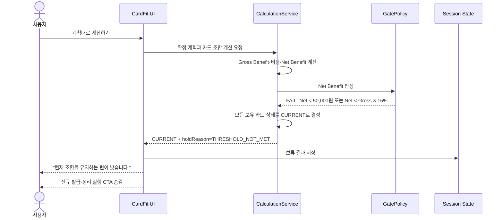
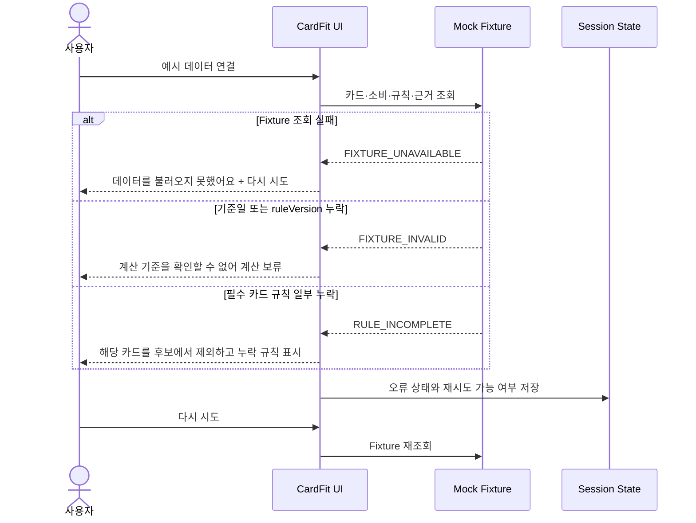
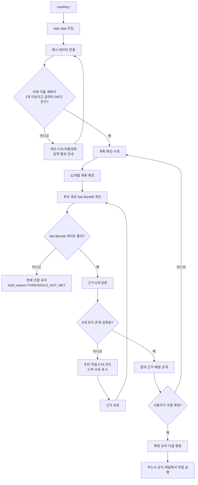

# CardFit 기술 설계 문서 v0.1

- 기준 문서: `docs/SRS.md`, `docs/specs/CALC_SPEC.md`, `docs/specs/TECH_SPEC.md`, `docs/specs/TEST_SPEC.md`
- 문서 목적: SRS의 요구사항을 구현 가능한 구조, 데이터, 화면 흐름으로 연결
- 범위: Mock Fixture 기반 MVP. 실제 카드사 API·인증·발급 연동은 제외
- 기준일: 2026-09-01

## 1. 설계 원칙과 문서 사용법

CardFit은 먼저 사용자의 앞으로 12개월 지출 계획을 확정하고, 그 계획에 맞춰 카드 조합을 계산한다. 계산 결과는 반드시 근거 6개를 검증한 뒤 공개한다. 근거가 하나라도 없으면 부분 계산으로 결론을 만들지 않고 결과를 보류한다.

| 설계 원칙 | 구현 의미 |
|---|---|
| 미래 계획 우선 | 최근 12개월 소비는 초기 제안의 입력이고, 최종 계산에는 사용자가 확인한 `FutureSpendPlan`만 사용 |
| 결정론적 계산 | 같은 입력·같은 `ruleVersion`이면 같은 결과를 반환 |
| 근거 완전성 | `PerformanceBand`, `BenefitCap`, `AnnualFee`, `Exclusion`, `AsOfDate`, `UnmodeledItem` 6개가 모두 있어야 결론 공개 |
| 안전한 보류 | Net Benefit 게이트 미통과 시 `CURRENT`를 반환하고, 근거 누락 시 `EVIDENCE_INCOMPLETE`를 반환 |
| 실행 경계 분리 | 추천은 CardFit에서, 카드 발급·변경 실행은 카드사 공식 채널에서 수행 |

## 2. Actor와 Use Case

### 2.1 Actor

- **사용자(User)**: 보유 카드와 지출 계획을 확인·수정하고 계산 결과를 검토한다.
- **CardFit UI**: 입력, 검증 상태, 결과, 보류 사유를 표시한다.
- **계산 도메인(Domain)**: 후보 생성, 혜택·비용 계산, Net Benefit 게이트, 상태 판정을 수행한다.
- **Mock Fixture**: 보유 카드·최근 12개월 소비·카드 규칙·근거를 제공한다.
- **카드사 공식 채널(External)**: 신규 카드 신청 등 최종 실행을 담당한다.

### 2.2 Use Case 다이어그램

Use Case는 Mermaid Flowchart로 표현한다. Mermaid에는 표준 UML Actor 기호가 없으므로, 외부 Actor는 별도 노드로 두고 CardFit 시스템 경계 안의 기능은 타원형 노드로 구분한다.

### 2.3 주요 Use Case 명세

| ID | Use Case | 사전 조건 | 기본 흐름 | 대체·실패 흐름 |
|---|---|---|---|---|
| UC-01 | 예시 데이터 연결 | 앱 진입 | Fixture 로드 → 기준일·ruleVersion 표시 → 현재 카드 요약 | Fixture 오류 시 오류 상태와 재시도 표시 |
| UC-02 | 미래 지출 계획 확정 | 현재 카드 요약 확인 | 카테고리별 제안 표시 → 사용자가 확인·수정 → 1개 이상 계획 저장 | 모든 값 삭제/0이면 계산 CTA 차단 |
| UC-03 | 카드 조합 계산 | 확정된 계획 존재 | 후보 생성 → 혜택 계산 → 비용 차감 → Net Benefit 게이트 | 게이트 미통과 시 `CURRENT` 유지 |
| UC-04 | 근거 검증 결과 확인 | 계산 결과 존재 | 6개 근거 표시 → 출처·기준일 표시 | 하나라도 누락되면 추천 결과·적용 CTA 차단 |
| UC-05 | 조합 확정 | 공개 가능한 결과 존재 | 조합 저장 → 다음 행동과 실행 경계 표시 | `CURRENT` 카드에는 발급 CTA를 표시하지 않음 |
| UC-06 | 누락 근거 복구 | `EVIDENCE_INCOMPLETE` | 누락 항목 설명 → 정보 보완 → 동일 입력 재계산 | 재검증 전까지 이전 보류 상태 유지 |

## 3. 논리 데이터 모델(ERD)

### 3.1 핵심 엔터티와 필드 규칙

| 엔터티 | 필수 필드 | 규칙 |
|---|---|---|
| `FutureSpendPlan` | `category`, `monthlyAmount`, `direction`, `confirmed` | 금액은 0 이상 정수. 최종 계산은 `confirmed=true`만 사용 |
| `CalculationRun` | `basisPeriod`, `status`, `grossBenefit`, `netBenefit`, `holdReason` | `basisPeriod`는 MVP에서 최근 12개월. 계산 실패와 게이트 보류를 구분 |
| `PlanCandidate` | `decision`, `grossBenefit`, `netBenefit` | `NEW`, `KEEP`, `ORGANIZE` 중 정확히 하나의 결론 상태 |
| `EvidenceItem` | `type`, `value`, `verified` | 여섯 유형을 모두 갖추지 못하면 공개 불가 |
| `Allocation` | `category`, `monthlyAmount`, `expectedBenefit` | 계획 총액과 카테고리별 배분액의 합을 검증 |

## 4. 클래스·도메인 구조(CLD)

### 4.1 계산 순서

1. `FutureSpendPlan`의 확정 여부와 금액을 검증한다.
2. 후보 카드를 생성하고 카테고리별 `Gross Benefit`을 계산한다.
3. 연회비·재적립 손실·발급 대기 비용을 차감해 `Net Benefit`을 계산한다.
4. `Net Benefit >= 50,000원` 그리고 `Net Benefit >= Gross Benefit × 15%`를 함께 적용한다.
5. 게이트를 통과하지 못하면 `CURRENT` 중심 결과를 생성한다.
6. 후보별 필수 근거 6개를 검증한다.
7. 근거가 완전한 결과만 공개하고, 누락이면 `EVIDENCE_INCOMPLETE`로 보류한다.

## 5. 컴포넌트 다이어그램

구현 시 UI는 계산 규칙을 직접 소유하지 않는다. UI는 입력과 표시를 담당하고, `CalculationService`가 도메인 결과와 `holdReason`을 반환한다. 이를 통해 같은 계산 규칙을 테스트와 화면에서 공유할 수 있다.

## 6. 대표 Sequence Diagram

### 6.1 정상 흐름 참조

정상적인 전체 사용자 여정은 중복해서 관리하지 않고 [`BUSINESS_SEQUENCE.md`](BUSINESS_SEQUENCE.md)를 기준으로 한다. 해당 문서에는 예시 데이터 연결, 미래 지출 계획 확정, 후보 계산, Net Benefit 판정, 근거 검증, 결과 공개, 조합 확정, 카드사 공식 채널 실행 경계까지 포함되어 있다.

이 문서의 Sequence Diagram은 정상 흐름에 대한 대체 문서가 아니라, 정상 흐름에서 분기되는 예외·오류·복구 동작을 상세화한 보조 설계다.

### 6.2 근거 누락·복구

### 6.3 미래 지출 입력 오류

입력값이 없거나 유효하지 않으면 계산 도메인을 호출하지 않는다. 사용자가 수정할 수 있도록 입력 화면에 남긴다.

### 6.4 Net Benefit 기준 미달

계산은 완료됐지만 비즈니스 게이트를 통과하지 못한 경우다. 오류가 아니라 안전한 유지 결과로 처리한다.

### 6.5 Mock Fixture 또는 규칙 데이터 오류

필수 데이터가 없으면 계산 전에 중단한다. 불완전한 규칙으로 추정 계산하지 않는다.

### 6.6 세션·외부 실행 경계 규칙

세션 복구와 카드사 공식 채널 이동은 별도 Sequence로 분리하지 않고 다음 규칙으로 관리한다.

- 계획 수정 또는 앱 재진입 시 마지막 입력 스냅샷을 복원하되, `confirmed=true`로 재확정하기 전에는 계산에 사용하지 않는다.
- 확정 조합은 `ruleVersion`, 기준일, 금액을 함께 동결한다. 버전 변경 또는 기준일 +30일 경과 시 자동 재계산하지 않고 재검증을 요청한다.
- 신규 카드가 포함된 경우 공식 카드사 채널로 최대 1개 아웃링크만 제공한다. CardFit은 신청·심사·해지를 직접 실행하지 않는다.
- `유지`·`정리` 카드에는 실행 버튼을 제공하지 않고 다음 행동 안내만 표시한다.

### 6.7 예외 결과 상태 계약

| 상황 | 상태 코드 | UI 동작 | 다음 복구 행동 |
|---|---|---|---|
| 계획 0건·금액 0원·형식 오류 | `INVALID_PLAN` | 계산 요청 차단, 입력 오류 표시 | 계획 수정 |
| Net Benefit 기준 미달 | `THRESHOLD_NOT_MET` | `CURRENT` 유지, 신규·정리 CTA 숨김 | 계획 재수정 또는 종료 |
| Fixture 조회 실패 | `FIXTURE_UNAVAILABLE` | 데이터 오류·재시도 표시 | Fixture 재조회 |
| 기준일·규칙 버전 누락 | `FIXTURE_INVALID` | 계산 보류 | 유효한 Fixture 재조회 |
| 카드 규칙 일부 누락 | `RULE_INCOMPLETE` | 해당 후보 제외, 누락 규칙 표시 | 규칙 보완 후 재계산 |
| 근거 6개 중 하나 이상 누락 | `EVIDENCE_INCOMPLETE` | 추천 결과·적용 CTA 차단 | 근거 보완 후 재검증 |

## 7. 화면 및 상태 Flow Chart

## 8. API·인터페이스 개요

MVP에서는 실제 HTTP 서버 대신 동일한 계약을 가진 함수/Mock Repository로 시작한다. 추후 API 서버로 분리할 때도 요청·응답 구조는 유지한다.

| 인터페이스 | 입력 | 출력 | 제약 |
|---|---|---|---|
| `GET /api/fixtures/:fixtureId` | `fixtureId` | currentCards, pastSpend(12개월), rules, asOfDate, ruleVersion | 외부 개인정보·실결제 연동 없음 |
| `POST /api/sessions/:id/future-plan` | plans[] | normalized plans, validation | 금액 정수·0 이상, category 중복 병합 |
| `POST /api/calculations` | sessionId, confirmedPlan, cards | runId, candidates, status, holdReason, evidence | 미확정 계획은 거부 |
| `GET /api/calculations/:runId/evidence` | runId | six evidence items, source metadata | 누락 시 `EVIDENCE_INCOMPLETE` |
| `POST /api/sessions/:id/confirm` | candidateId | confirmation summary | `COMPLETE` 결과만 확정 가능 |

### 오류 계약

`EVIDENCE_INCOMPLETE` 응답은 다음 필드를 반환한다.

| 필드 | 타입 | 예시 | 설명 |
|---|---|---|---|
| `code` | string | `EVIDENCE_INCOMPLETE` | 필수 근거 누락 오류 코드 |
| `message` | string | 필수 근거가 모두 확인되지 않아 추천 결과를 보류했습니다. | 사용자에게 표시할 안내 문구 |
| `missing` | string[] | `AnnualFee` | 누락된 근거 유형 목록 |
| `retryable` | boolean | `true` | 근거 보완 후 재검증 가능 여부 |

화면에서는 `code`를 내부 상태 판정에 사용하고, `message`·`missing`을 사용자 안내에 사용한다. `retryable=true`인 경우에만 “근거 보완 후 다시 검사” 버튼을 표시한다.

## 9. SRS 추적성 및 배치 위치

| SRS 항목 | 설계 문서 위치 |
|---|---|
| FR-001 미래 지출 입력 | Use Case UC-02, `FutureSpendPlan`, 화면 Flow A~G |
| FR-002 12개월 기준 혜택 계산 | 계산 순서 1~3, `CalculationRun.basisPeriod` |
| FR-003 Net Benefit 게이트 | 계산 순서 4~5, Flow H~J |
| FR-004 결제수단 배분 | `Allocation`, 정상 Sequence의 결과 표시 |
| FR-005 계산 근거 공개 | Evidence ERD, 정상 화면의 근거 6개 |
| FR-006 초기값 자동 제안 | UC-02, Fixture → UI 흐름 |
| FR-007 이벤트 변수 입력 | `FutureSpendPlan` 확장 필드로 관리; MVP에서는 제한적 |
| FR-008 조합 확정·실행 경계 | UC-05, Component의 Official 경계 |
| AC-001 입력 0건 차단 | Flow D~E |
| AC-002 근거 6개 완전성 | Flow K~N, Sequence 6.2 |
| AC-004 게이트 미통과 | Flow I~J |

SRS의 사용자 흐름 챕터에는 이 문서의 **7장 Flow Chart**를, 계산·근거 챕터에는 정상 흐름을 정의한 [`BUSINESS_SEQUENCE.md`](BUSINESS_SEQUENCE.md)와 **6.2~6.7 예외 Sequence**를 참조하는 것을 권장한다.

## 10. 구현·검증 체크리스트

- [ ] `FutureSpendPlan.confirmed`가 아닌 값이 계산에 들어가지 않는지 확인
- [ ] 최근 12개월 기준 문구와 “앞으로의 지출은 아직 반영되지 않았어요” 문구 표시
- [ ] 후보마다 근거 6개를 표시하고, 하나 제거 시 결과가 공개되지 않는지 확인
- [ ] `unmodeled_bound`가 순이익 계산에 더해지지 않는지 확인
- [ ] `THRESHOLD_NOT_MET`와 `EVIDENCE_INCOMPLETE`를 서로 다른 화면 상태로 표시
- [ ] `CURRENT`와 `KEEP` 결과에 신규 발급 CTA가 노출되지 않는지 확인
- [ ] 브라우저 새로고침 전후 세션 상태 복구 여부를 결정하고 테스트에 반영
- [ ] SRS AC-001, AC-002, AC-004, AC-005, AC-006, AC-008을 구현 테스트와 연결

## 12. 다이어그램 우선순위

아래 순서는 “개발 전에 반드시 합의해야 하는 설계”에서 “구현 중 상세화해도 되는 설계” 순서다.

| 우선순위 | 다이어그램 | 이유 | SRS 반영 후보 |
|---|---|---|---|
| P0 | 화면·상태 Flow Chart | 입력 0건, 게이트 미통과, 근거 누락 시 제품이 어떻게 멈추는지 결정한다. | 2장 핵심 사용자 흐름, AC-001·002·004 |
| P0 | 정상·누락 Sequence Diagram | UI·계산 도메인·근거 검증기의 책임과 결과 공개 조건을 고정한다. | 2장 흐름, 3장 FR-003·005 |
| P0 | ERD | 계산 결과와 근거를 어떤 데이터로 보존할지 결정한다. `EvidenceItem` 누락 여부가 핵심이다. | 4장 데이터·계산 규칙 |
| P1 | Component Diagram | 정적 프로토타입에서 도메인 모듈로 확장할 때 책임 경계를 명확히 한다. | 6장 UI·아키텍처 개요 |
| P1 | Use Case Diagram | 사용자·Mock Fixture·외부 카드사 채널의 시스템 경계를 설명한다. | 2장 사용자 흐름, 7장 제약 |
| P2 | CLD | 클래스와 메서드 수준의 구현 구조를 구체화한다. 도메인 테스트 작성 시 유용하다. | SRS 본문보다는 구현 설계 문서에 유지 |

### 검토 권장 순서

1. P0 Flow Chart에서 사용자에게 결과를 보여주거나 보류하는 조건을 확인한다.
2. P0 Sequence Diagram에서 각 조건을 어느 컴포넌트가 판단하는지 확인한다.
3. P0 ERD에서 판단에 필요한 필드와 근거 6개가 충분한지 확인한다.
4. P1 Use Case·Component로 시스템 경계와 화면 범위를 확인한다.
5. 마지막으로 P2 CLD의 클래스·메서드가 실제 구현 단위로 적절한지 검토한다.
