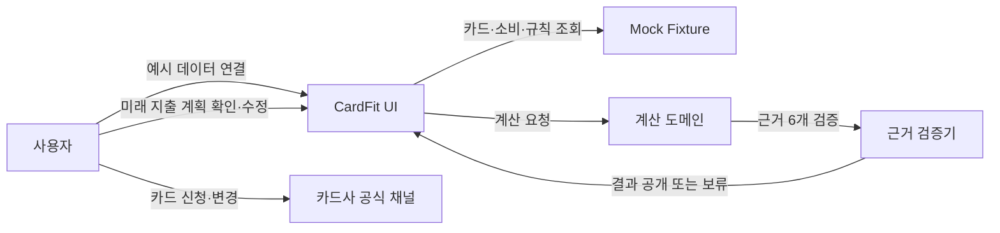
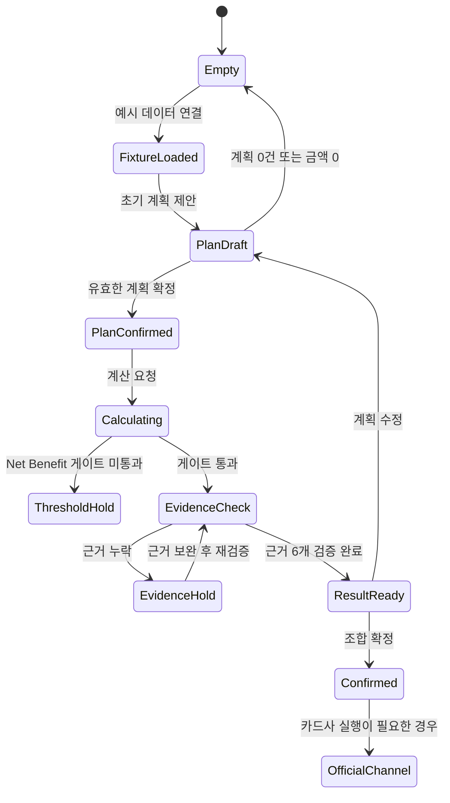

# CardFit Use Case Diagram v0.1

- 기준 문서: [`docs/SRS.md`](../SRS.md)
- 범위: Mock Fixture 기반 MVP
- 기준일: 2026-09-01

## 1. 시스템 범위

CardFit은 사용자가 앞으로 12개월의 지출 계획을 확인한 뒤, 카드 조합의 예상 혜택과 비용을 비교하도록 돕는다. 추천 결과는 근거 6개가 모두 검증된 경우에만 공개한다.

## 2. Use Case 목록

| ID | Use Case | Actor | 결과 |
|---|---|---|---|
| UC-01 | 예시 데이터 연결 | 사용자 | 현재 카드, 최근 12개월 소비, 기준일 표시 |
| UC-02 | 미래 지출 계획 입력·확정 | 사용자 | 확정된 `FutureSpendPlan` 저장 |
| UC-03 | 카드 조합 계산 | 사용자, 계산 도메인 | 후보별 Gross/Net Benefit 계산 |
| UC-04 | 계산 결과와 근거 확인 | 사용자, 근거 검증기 | 추천·유지·정리 상태 및 근거 6개 표시 |
| UC-05 | 근거 누락 복구 | 사용자, 근거 검증기 | 누락 사유 확인 후 재검증 |
| UC-06 | 조합 확정 및 다음 행동 확인 | 사용자 | 확정 요약과 카드사 공식 채널 이동 안내 |

## 3. Use Case 상세

### UC-01 예시 데이터 연결

- 사전 조건: 사용자가 CardFit 앱에 진입한다.
- 기본 흐름: 사용자가 예시 데이터 연결을 누른다 → Fixture가 카드·최근 12개월 소비·규칙을 반환한다 → UI가 기준일과 `ruleVersion`을 표시한다.
- 예외 흐름: Fixture를 불러오지 못하면 계산을 시작하지 않고 재시도 안내를 표시한다.
- 관련 요구사항: FR-006, AC-011, AC-012

### UC-02 미래 지출 계획 입력·확정

- 사전 조건: 현재 카드 요약을 확인했다.
- 기본 흐름: 카테고리별 초기 제안을 확인한다 → 금액과 증감 방향을 수정한다 → 사용자가 계획을 확정한다.
- 제약: 금액은 0 이상 정수이고, 최종 계산은 `confirmed=true`인 계획만 사용한다.
- 예외 흐름: 모든 항목이 삭제되거나 금액이 0이면 계산 CTA를 비활성화하고 입력을 요청한다.
- 관련 요구사항: FR-001, FR-006, AC-001, AC-007

### UC-03 카드 조합 계산

- 사전 조건: 1개 이상의 유효한 미래 지출 계획이 확정됐다.
- 기본 흐름: 후보를 생성한다 → 카테고리별 혜택을 계산한다 → 연회비·재적립 손실·발급 대기 비용을 차감한다 → Net Benefit 게이트를 적용한다.
- 게이트: `Net Benefit >= 50,000원` 그리고 `Net Benefit >= Gross Benefit × 15%`.
- 예외 흐름: 게이트를 통과하지 못하면 `THRESHOLD_NOT_MET`으로 현재 조합 유지를 반환한다.
- 관련 요구사항: FR-002, FR-003, FR-004, AC-004, AC-005

### UC-04 계산 결과와 근거 확인

- 사전 조건: 계산 도메인이 후보 결과를 생성했다.
- 기본 흐름: 후보별 추천·유지·정리 상태, 배분액, 순이익을 표시한다 → 다음으로 근거 6개를 표시한다.
- 필수 근거: 전월실적 구간, 혜택 한도, 연회비, 제외조건, 기준일, 미반영 항목.
- 성공 조건: 6개 항목이 모두 존재하고 검증됐을 때만 추천 결과와 적용 CTA를 노출한다.
- 관련 요구사항: FR-005, AC-002, AC-005, AC-006

### UC-05 근거 누락 복구

- 사전 조건: 필수 근거 중 하나 이상이 누락됐다.
- 기본 흐름: 결과를 공개하지 않는다 → 누락된 근거의 이름·사유·확인 방법을 표시한다 → 사용자가 정보를 보완한다 → 동일 입력으로 재검증한다.
- 예외 흐름: 재검증 전에는 이전 보류 상태와 적용 CTA 차단을 유지한다.
- 반환 오류: `EVIDENCE_INCOMPLETE` 및 `missing[]` 목록.
- 관련 요구사항: AC-002

### UC-06 조합 확정 및 다음 행동 확인

- 사전 조건: 근거 검증이 완료된 결과가 있다.
- 기본 흐름: 사용자가 조합을 확정한다 → 확정 조합과 카드별 다음 행동을 확인한다 → 신규 카드는 카드사 공식 채널로 이동한다.
- 제약: `CURRENT`와 `KEEP` 상태에는 신규 발급 CTA를 표시하지 않는다. CardFit은 카드 발급을 직접 실행하지 않는다.
- 관련 요구사항: FR-008, AC-003, AC-008

## 4. 핵심 상태 전이

## 5. 수용 기준 연결

| 기준 | Use Case 동작 |
|---|---|
| AC-001 | UC-02에서 유효 계획이 없으면 계산 결과를 반환하지 않는다. |
| AC-002 | UC-04에서 근거 6개 중 하나라도 누락되면 UC-05로 전환한다. |
| AC-004 | UC-03에서 게이트 미통과 시 `CURRENT` 중심 결과를 반환한다. |
| AC-005 | 모든 후보는 추천·유지·정리 중 하나의 상태를 가진다. |
| AC-008 | UC-06에서 확정 요약과 카드사 실행 경계를 표시한다. |
