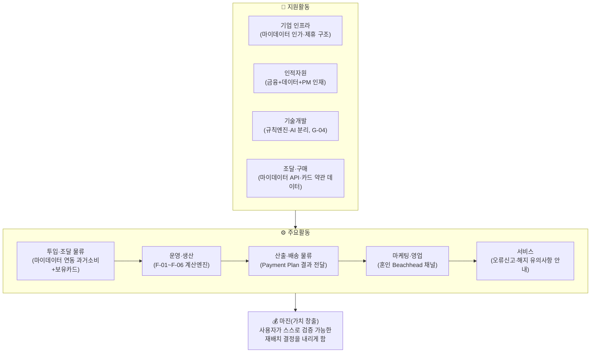

# 02. 기업 내부 활동의 가치사슬 분석 — 미래지출 결제설계 서비스

> **서비스 정의 (고정)**: 마이데이터로 확보한 과거 소비 기록과 사용자가 직접 입력한 미래 소비 변화(혼인·이사 등)를 함께 반영해, 보유·신규카드의 실적 구간·혜택한도·연회비를 계산 근거와 함께 공개하며 실행 가능한 카드 조합 재배치안을 제시하는 서비스.
>
> 방법론: `business-analysis-frameworks/02_가치사슬_분석/00_방법론.md`(설계 질문🏗️ / 개선 질문🚀 프레임)을 따름. `01_Porters_Five_Forces_분석.md`의 공급자 교섭력·대체재 위협 결론을 입력으로 사용.
> 표기: 🔵 Fact · ⚪ Inference · 🟡 Assumption · 🟠 미확인 — `방법론.md` 8장 기준.

---

## 0. 구조 한눈에 보기

---

## 0-1. 차별화 활동 축 — 경쟁자 체인 vs 우리 체인

표준 가치사슬 5개 활동 버킷(투입물류·운영·산출물류·마케팅·서비스) 안에 우리 차별점이 흩어져 있어 한눈에 안 보인다. 실제로 경쟁을 가르는 건 이 3단계다.

- **경쟁자(뱅크샐러드·토스·카카오페이) 체인**: 과거 소비 조달(마이데이터) → 단일 카드 매칭(Rule 대입) → 결과 표시(발급 연계) — 2단계
- **우리 체인**: **Future Intent Capture**(F-01, 사용자가 미래 소비 변화를 직접 입력) → **Scenario Modeling**(F-02~F-03, 제약조건+시나리오 계산) → **Constraint Optimization**(F-04, 해지·유지·신규를 함께 계산해 하나의 결론으로 압축) — 3단계

경쟁자 체인에는 앞뒤 두 단계(Future Intent Capture, Constraint Optimization)가 아예 없다 — "과거 소비 조달 → 단일 카드 매칭"만 있고 끝난다(🔵 `01_Porters_Five_Forces_분석.md` §5 뱅크샐러드 3조건 판정). 아래 §1-1~1-5는 이 3단계를 Porter 표준 버킷에 맞춰 풀어 쓴 것이다.

---

## 1. 주요활동(Primary Activities)

### 1-1. 투입·조달 물류 — 마이데이터 연동으로 과거 소비·보유카드 확보

| 질문 유형 | 우리 서비스에 대한 답 |
| --- | --- |
| 🏗️ 핵심 투입자원은 무엇인가? | 마이데이터 API로 확보한 **과거 소비 기록**(가맹점·업종·금액)과 **보유카드 목록**, 사용자가 직접 입력하는 **미래 소비 변화값**(카테고리·금액·시점) — 두 축이 F-01~F-02의 원자재 |
| 🏗️ 마이데이터를 어떻게 확보할 것인가? | MVP부터 마이데이터 연동 포함 확정(`decision-log/decision-log.md` 2026-08-19). 직접 인가 취득 vs 기존 인가 사업자(뱅크샐러드·토스류) 제휴 중 선택 미확정(`0818_쟁점정리.md` 쟁점 1) |
| 🏗️ 어떤 데이터는 자체 확보하고 어떤 건 제휴로? | 과거 소비 데이터는 마이데이터 API로 외부 확보, 카드 혜택 Rule(전월실적·한도·제외항목)은 카드사별 공식 약관에서 직접 수집(🔵 `국내 신용카드 시장 리서치.md` 2절) — 통합 API가 없어 수작업/스크래핑성 수집이 불가피 |
| 🚀 외부 마이데이터 채널 의존도를 줄일 수 있는가? | 단일 채널(마이데이터 API)만 존재해 대체 경로가 없음(01 문서 공급자 교섭력 참고) — 대신 API 장애 시 "최근 확인된 데이터 기준" 경고(G-03)로 완화 |
| 🚀 카드사별 약관 데이터의 정확성·최신성을 어떻게 높이나? | 카드혜택 Rule 버전관리(적용 시작일·종료일 기록)와 최신성 경고 표시를 기술설계 원칙에 포함(`효진/미래지출_카드조합_추천서비스_MVP_고려사항_및_범위.md` 3.10·3.11 데이터 관리 체크리스트) |

### 1-2. 운영·생산 — 미래 소비 변화를 반영한 카드조합 계산

| 질문 유형 | 답 |
| --- | --- |
| 🏗️ 고객 요청을 금융 가치로 변환하는 핵심 처리는? | F-03 시나리오 계산 — 과거 소비(마이데이터) + 미래 변화(직접입력)를 카드별 전월실적 구간·혜택한도·연회비 규칙에 대입해 예상 순혜택을 산출 |
| 🏗️ 흐름을 어떻게 설계하는가? | 마이데이터 연동(과거 소비·보유카드 확인) → 미래 소비 변화 입력(F-01) → 제약조건 입력(F-02) → 시나리오 계산(F-03) → 해지·유지·신규추가를 함께 계산해 하나의 최적 조합으로 압축(F-04) → 결제수단 배분(F-05) → 근거 공개(F-06) |
| 🏗️ 자동화와 수동 판단의 경계는? | 혜택 금액 계산은 결정론적 규칙 엔진, AI는 계산 근거를 사용자 언어로 설명하는 역할에 한정(G-04) — 이 경계가 무너지면 "혜택을 보장한다"는 오해로 이어질 규제 리스크(`0818_1페이지 브리프.md` 7절 질문3) |
| 🚀 처리 정확도·오류율을 어떻게 낮추나? | T-01~T-10 필수 테스트 케이스(전월실적 1원 부족, 월 한도 초과, 실적 충돌 등)로 경계값 검증 |
| 🚀 부정확한 데이터로 계산 시 어떻게 하나? | 필수 데이터 누락 시 추천 중단, 데이터가 오래되면 사용자에게 경고(G-03·G-06) |

### 1-3. 산출·배송 물류 — Payment Plan 결과 전달

| 질문 유형 | 답 |
| --- | --- |
| 🏗️ 고객은 결과를 어떤 형식으로 받는가? | 계산으로 압축된 **하나의 최종 추천 조합**(예: "A·B카드 해지, C카드 유지, D카드 신규 추가"), 카드별 역할·배분금액, 지금 그대로 두면 놓치는 금액과 계산 근거, 적용되지 않은 조건을 함께 제시(F-04~F-06) |
| 🏗️ 사용자가 즉시 이해할 수 있는가? | 결론 → 핵심 변화 → Trade-off → 근거 → 상세 Rule 순의 정보 계층(토스 UX 원칙 벤치마킹, `윤정/미래지출_결제리밸런싱_역기획_벤치마킹_보고서.md` 5절) |
| 🚀 정보 우선순위가 명확한가? | 첫 화면에는 핵심 결과·필요한 변경·가장 큰 장점·가장 큰 단점, 이 4개 정보만 보여주고, 세부 계산 과정은 사용자가 눌러야 그때 펼쳐 보이도록 단계적으로 숨겨둔다 |

### 1-4. 마케팅 및 영업 — 혼인 Beachhead 채널

| 질문 유형 | 답 |
| --- | --- |
| 🏗️ 핵심 고객은 누구인가? | Beachhead = 혼인·이사 등 1~3개월 내 고액구매 예정 + 마이데이터 이용자(TAM), SOM = 혼인 채택자 |
| 🏗️ 왜 우리 서비스를 써야 하는가? | 뱅크샐러드·토스·카카오페이는 과거 소비만 보고 카드 1장을 추천하지만, 우리는 미래 변화를 반영해 조합을 재설계하고 근거를 공개함(차별점 A·B·C) |
| 🏗️ 어떤 채널로 유치하는가? | 웨딩업체 제휴 등 Trigger 감지 가능성이 높은 채널(Q1 세그먼트, `0818_쟁점정리.md` 쟁점 3 Segment Map) |
| 🚀 고객 획득비용 대비 장기 수익을 어떻게 높이나? | 🟠 미확보 — 자동화된 서비스 대신 사람이 직접 수동으로 응대하며 실제 수요를 미리 확인하는 초기 검증 방법(Concierge Test, 피치덱 9장)으로 Payment Plan Selection Rate(사용자가 제시된 카드조합 안을 실제로 선택하는 비율) 실측 필요 |

### 1-5. 서비스 — 계산 오류 신고·해지 유의사항 안내

| 질문 유형 | 답 |
| --- | --- |
| 🏗️ 어떤 사후지원이 필요한가? | 계산 오류 신고·정정 절차, 해지 시 유의사항(포인트 소멸·자동납부 승계 여부) 안내 |
| 🏗️ F-05를 "판단 근거 + 유의사항 안내"로 한정하는 이유는? | 카드 해지 절차 자체의 마찰(상담사 만류·복잡한 절차)이 실제 민원으로 확인됨(🔵 뉴스토마토 2025.10.13, `국내 신용카드 시장 리서치.md` 1-4-1) |
| 🚀 반복 문의를 제품 개선으로 없앨 수 있는가? | 계산 오류율·불필요한 신규카드 추천 비율을 검증지표로 추적(3.13 체크리스트) |

---

## 2. 지원활동(Support Activities)

### 2-1. 기업 인프라 — 마이데이터 인가/제휴 구조

| 질문 유형 | 답 |
| --- | --- |
| 🏗️ 어떤 법인·조직이 마이데이터를 담당하는가? | 🟠 미확정 — 직접 인가 취득 vs 기존 인가 사업자 제휴, 두 경로 중 선택 필요(`0818_쟁점정리.md` 쟁점 1) |
| 🏗️ 금융규제·개인정보 요구를 어떻게 반영하는가? | 여신전문금융업법·개인정보보호법 전송요구권 확대, 마이데이터 6대 허가요건(자본금 5억원 등, 🟠 최신 개정 확인 필요)을 전제로 사업계획 수립 |
| 🚀 성장지표와 리스크지표가 충돌할 때 기준은? | 🟠 미확정 — 규제 리스크(재무자문 분류 여부, `0818_1페이지 브리프.md` 7절 질문3)가 해소되기 전까지는 리스크 우선 판단 권장 |

### 2-2. 인적자원 관리 — 금융+데이터+제품 역량 결합

| 질문 유형 | 답 |
| --- | --- |
| 🏗️ 어떤 인재가 필요한가? | 금융(카드 약관·마이데이터 규제 이해), 데이터(혜택 Rule 파싱·버전관리), 제품(계산 로직 설계) 역량의 결합 |
| 🏗️ 최종 책임자는 누구인가? | 팀 역할분배(`decision-log/decision-log.md` 2026-08-14) — 윤정(시장·기업 분석/서비스설계), 가람(고객 분석), 효진(제품·PM) |

### 2-3. 기술 개발 — 규칙엔진과 AI 설명의 분리

| 질문 유형 | 답 |
| --- | --- |
| 🏗️ 핵심 경쟁력을 만드는 기술은? | 카드혜택 계산은 **결정론적 규칙 엔진**, AI는 약관 요약·추천 근거의 자연어 설명에만 사용(G-04) — "AI가 혜택금액을 임의 계산하지 않는다"는 원칙 |
| 🏗️ 다수 카드사 데이터를 낮은 결합도로 다루려면? | 카드사별 혜택 Rule을 별도 레이어로 관리하고 정책혜택(K-패스 등)과 카드사 자체 혜택을 분리(3.11 기술설계 원칙) |
| 🚀 배포속도와 계산 안정성을 동시에? | 경계값 자동 테스트(T-01~T-10), 계산 과정·적용 규칙 로그 보존으로 재현 가능성 확보 |

### 2-4. 조달·구매 — 마이데이터 API·카드 데이터 소스 확보

| 질문 유형 | 답 |
| --- | --- |
| 🏗️ 필요한 외부 솔루션은? | 마이데이터 표준 API(카드 업권 정보제공 API 규격, 🔵 마이데이터 종합포털 2025.09 개정판), 카드사별 공식 약관 데이터 |
| 🏗️ 공급자 장애·계약 종료 대응은? | 🟠 미확정 — 마이데이터 API 접근이 단일 채널이라 대체 공급자가 없음(01 문서 공급자 교섭력 참고), Guardrail G-03(데이터 최신성)으로 부분 완화 |

---

## 3. 종합 — 병목과 개선 기회

| 병목 지점 | 원인 | 개선 기회 |
| --- | --- | --- |
| 투입·조달 물류 | 마이데이터가 단일 채널·카드 혜택 Rule이 파편화 | 인가/제휴 경로 조기 확정, 혜택 Rule 버전관리 체계 구축 |
| 운영·생산 | 계산 로직과 AI 설명의 경계가 흐려지면 규제 리스크 | G-04(계산과 설명 분리)를 시스템 설계 단계에서 강제 |
| 서비스 | 해지 실행 마찰이 사용자 기대와 서비스 능력 사이 괴리를 만듦 | F-05 스코프를 "판단 근거+안내"로 명확히 제한 |
| 기업 인프라 | 마이데이터 법인 구조 미확정 | KSF(03 문서)의 최우선 항목으로 연결 |
