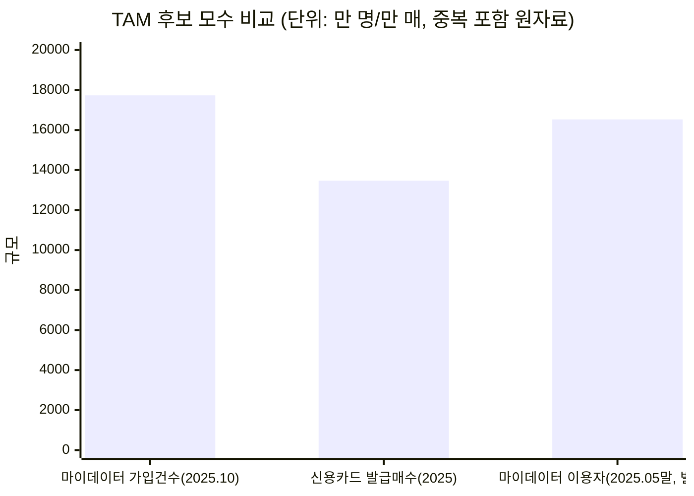
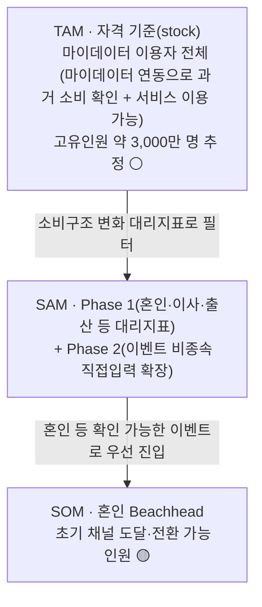

# 04. TAM-SAM-SOM 과 Market Segment Map — 미래지출 결제설계 서비스

> **서비스 정의 (고정, 이 문서 전체가 이 정의를 벗어나지 않음)**: 마이데이터로 확보한 과거 소비 기록과 사용자가 직접 입력한 미래 소비 변화(혼인·이사 등)를 함께 반영해, 보유·신규카드의 실적 구간·혜택한도·연회비를 계산 근거와 함께 공개하며 실행 가능한 카드 조합 재배치안을 제시하는 서비스.
>
> **TAM = 마이데이터 이용자 (고정, 재논의 대상 아님).** 방법론: `business-analysis-frameworks/04_TAM-SAM-SOM_마켓세그먼트/00_방법론.md`의 "AI와 협업해 리서치를 수행하는 7단계 전략"을 따름. 기존 산출물(`0818_쟁점정리.md` 쟁점 3, `효진/TAM-SAM-SOM 정의 작업안.md`, `decision-log/decision-log.md` 2026-08-19)을 이 7단계 틀로 재구성·통합한 최종본.
> 표기: 🔵 Fact · ⚪ Inference · 🟡 Assumption · 🟠 미확인 — `방법론.md` 8장 기준.

---

## 0. 7단계 전략 진행 상태

| 단계 | 전략 단계 이름 | 이 프로젝트에서의 결과 | 상태 |
| --- | --- | --- | --- |
| 1 | 광범위한 탐색 | 국내 신용카드·마이데이터 시장 전반 리서치 | 🔵 완료 |
| 2 | 범위 축소 | TAM 정의문 확정 — **마이데이터 이용자**, 단위=사용자 수(명) | 🔵 완료 |
| 3 | 핵심 원인 분석 | 소비구조 변화가 발생하는 생애이벤트(혼인·이사·출산) 식별 | 🔵 완료 |
| 4 | 가설 수립 | SAM 대리지표 세트(혼인·이사·출산·이직) 확정 | 🔵 완료 |
| 5 | 정량적 검증 | 대리지표 실수치 KOSIS 수집 | 🟠 진행 중 |
| 6 | 반복적 정제 | 중복 제거 + 보수/기본/공격 3시나리오 | 🟠 진행 중 |
| 7 | 솔루션 구체화 | Market Scope 슬라이드 + Segment Map | 🔵 구조 확정, 🟠 실수치 대기 |

---

## 1. 광범위한 탐색 (Broad Inquiry)

**질문**: "국내 카드조합 재설계 서비스의 시장 규모를 어떤 지표로 잡을 수 있는가?"

수집된 모수 후보와 집계 기준(🔵 `국내 신용카드 시장 리서치.md` 1~5절):

| 후보 지표 | 값 | 집계 기준 | TAM으로 쓸 수 있는가 |
| --- | --- | --- | --- |
| 마이데이터 가입 건수 | 1억 7,734만 건(2025.10) | 서비스별 가입 누계, 중복 포함 | ⚪ 고유인원 환산 후 가능 — **채택** |
| 마이데이터 이용자 수(별도 집계) | 약 1억 6,531만 명(2025.05말) | 상이한 산정 기준 추정 | 🟠 위 수치와 정합성 미확인, 재검증 필요 |
| 신용카드 발급매수 | 1억 3,466만 매(2025) | 카드 장수, 1인 다중보유 포함 | ✗ 사람 수 아님 |
| 개인카드 국내 이용액 누계 | 약 275.97조원 | 누계 거래액 | ✗ 사람 수 아님 |

**직접 판단**: 마이데이터 가입 건수만이 "지출을 능동적으로 확인하는 사람"이라는 서비스 자격 기준과 직접 연결된다. 신용카드 발급매수는 카드 보유 여부만 나타내고 마이데이터 이용 여부와는 무관하다(아래 2절 참고).

---

## 2. 범위 축소 (Funneling) — TAM 정의문 확정

**단위·기간·지표 고정**:
- 단위: **사용자 수(명) 하나만 사용.** BM이 미정(일회성 vs 지속형)인 상태에서 "평균 미획득 혜택률" 같은 가정을 금액(₩) 지표에 또 얹으면 가정 위에 가정을 쌓는 꼴이라, TAM은 처음부터 끝까지 사용자 수로만 정의한다
- 지역: 국내
- 기간: 2026년 기준
- 지표: **마이데이터 이용 활성 사용자**(발급매수·가입누계가 아니라 실제 이용 여부)

**TAM 정의문**:

> **TAM = 마이데이터 서비스(뱅크샐러드·토스·카카오페이 등)를 이용해 본인 지출을 능동적으로 확인하는 사용자 전체.**

```
TAM_user = 마이데이터 이용 고유인원 수 (명, 서비스별 중복가입 제거)
```

| 변수 | 값 | 구분 | 근거 |
| --- | --- | --- | --- |
| 마이데이터 가입 건수 | 1억 7,734만 건(2025.10, 중복포함) | 🔵 Fact | 마이데이터 종합포털 |
| 마이데이터 고유인원 수 | 약 3,000만 명 추정 | ⚪ Inference | 서비스별 중복가입 제거 방식 미확정 — 1.77억 건 vs 1.65억 명(2025.05말) 집계 기준 상이 문제 반영 필요(🟠) |

**정의 근거**: 신용카드 실사용자를 앵커로 잡으면 채택 가능성이 낮은 인구와 디지털 비친화 인구까지 과다포함해 필터링 기능을 하지 못한다(`0818_쟁점정리.md` 쟁점 3). 마이데이터 이용자는 지출을 능동적으로 확인하려는 의향과 디지털 앱 사용 능숙도를 동시에 가진 집단이고, MVP가 마이데이터 연동을 전제하므로(`0818_쟁점정리.md` 쟁점 1) 이 정의가 실제 이용 자격과 일치한다.

> 남은 작업은 고유인원 환산 방식(🟠)을 확정하는 정량 검증이다.

---

## 3. 핵심 원인 분석 (Causal Analysis)

**질문**: "카드 조합 재설계 수요는 언제, 왜 발생하는가?"

소비구조 변화의 발생 원인을 생애이벤트 축으로 좁힘(🔵 `국내 신용카드 시장 리서치.md`, `0818_쟁점정리.md` 쟁점 3 Segment Map):

| 후보 원인 | Trigger 감지 가능성 | 1인당 지출강도 |
| --- | --- | --- |
| 혼인 | 높음(웨딩업체 신호로 감지 용이) | 최고 — 카드결제 대상 지출 1,473만~2,203만원(🔵 E-03~E-06) |
| 입주(이사) | 낮음(부동산 중개 파편화) | 🟠 확인 안 됨 — Q1을 능가할 가능성 있어 우선 리서치 대상 |
| 출산 | 혼인·이사와 강하게 중복 | 🟠 미수집 |
| 이직·전직 | — | 소비변화 유의성이 위 셋보다 약함(🟡) |

**직접 판단**: 혼인이 가장 데이터 신뢰도가 높은 원인이므로 1차 Beachhead로 채택. 다만 자녀 입학·유학·은퇴 등 다른 원인도 같은 JTBD(소비구조 변화 대응)를 만들며, 유학·은퇴처럼 소비가 감소하는 방향의 이벤트는 별도 설계가 필요함(쟁점 2의 "이벤트 비종속" 원칙과 연결).

---

## 4. 가설 수립 (Hypothesis Formation)

**가설**: SAM = TAM(마이데이터 이용자) 중 향후 12개월 내 소비구조가 유의미하게 바뀔 것으로 예상되는 사용자 — 혼인·이사·출산 등 대리지표로 측정 가능하다.

```
SAM_user = [ Σ(연간 소비변화 이벤트 발생 인원) − 중복 ] × 마이데이터 이용률
```

> TAM이 마이데이터 이용자로 정의되므로, 대리지표의 모수는 **마이데이터 이용률**로 필터링한다.

| 대리지표 | 출처 | 상태 | 주의점 |
| --- | --- | --- | --- |
| 혼인 건수 × 2(양 당사자) | 통계청 KOSIS 「혼인·이혼통계」 | 🟠 수집 중 | 재혼 포함 여부 명시 필요 |
| 주민등록 전입(이사) 세대 수 | 통계청/행안부 | 🟠 수집 중 | 개인이 아니라 세대 기준으로 잡아야 중복 감소 |
| 출생아 수 | 통계청 「출생통계」 | 🟠 수집 중 | 혼인·이사와 강하게 중복 |
| 이직·전직자 수 | 경제활동인구조사 | 🟠 수집 중 | 소비변화 유의성 약해 🟡로 별도 분리 |

SOM 가설: SAM(Phase 1) 중 Beachhead(혼인) 채택자 = SAM_user × Beachhead 비중 × 초기 채널 도달률 × Payment Plan Selection Rate — 세 변수 모두 검증 전(🟡).

---

## 5. 정량적 검증 (Quantitative Validation) — 🟠 진행 중

현재까지 확보된 1차 숫자와 미수집 구간:



> 세 수치가 서로 집계 기준이 달라 단순 비교가 위험함을 보여주는 시각화다 — 신용카드 발급매수는 TAM에서 제외했으므로 참고용으로만 남긴다. 마이데이터 가입건수와 마이데이터 이용자(별도 집계)의 차이(1.77억 vs 1.65억)는 고유인원 환산 시 반드시 재확인해야 한다(🟠).

**미수집 구간**: SAM 대리지표 실수치(혼인·이사·출산 KOSIS 원자료), TAM 고유인원 환산 공식, 1인당 평균 카드 보유 장수.

---

## 6. 반복적 정제 (Iterative Refinement) — 🟠 진행 중

**중복 제거 원칙**: 신혼 1쌍은 혼인+이사+(경우에 따라)출산에 모두 잡힐 수 있음 — "세대(가구) 단위" 카운트로 통일.

**3시나리오 민감도 설계 (틀만 확정, 수치는 미확정)**:

| 시나리오 | 중복률 가정 | 마이데이터 이용률 가정 | 산출 방식 |
| --- | --- | --- | --- |
| 보수 | 0.8(중복 많음) | 낮음 | SAM_user 최소값 |
| 기본 | 0.65 | 중간 | SAM_user 중심값 |
| 공격 | 0.5(중복 적음) | 높음 | SAM_user 최대값 |

> 실제 비율은 5절의 KOSIS 원자료 수집이 끝난 뒤 채운다. 이 표는 "어떤 축으로 민감도를 보일 것인가"의 구조만 확정한 것이다.

---

## 7. 솔루션 구체화 (Solution Definition) — Market Scope + Segment Map

### 7-1. TAM-SAM-SOM 구조도



### 7-2. 세 층의 정의 (최종본)

| 층 | 정의 | 값 | 상태 |
| --- | --- | --- | --- |
| **TAM** | 마이데이터 서비스를 이용해 본인 지출을 능동적으로 확인하는 사용자 전체 | 고유인원 약 3,000만 명 추정 | ⚪ 고유인원 환산 방식 확정 필요 |
| SAM(Phase 1) | TAM 중 향후 12개월 내 소비구조가 유의미하게 바뀔 것으로 예상되는 사용자 | 혼인 연간 약 48만 명(240,326건×2, ⚪) 등 대리지표 합산 예정 | 🟠 수집 중 |
| SAM(Phase 2) | 제품 로직 일반화 후, 이벤트 종류와 무관하게 소비 변화를 직접 입력하는 전체 사용자로 자연 확장 | — | ⚪ 추정(쟁점 2의 이벤트 비종속 결론이 근거) |
| SOM | SAM(Phase 1) 중 Beachhead(혼인) 채택자 | 세 변수(비중·도달률·선택률) 모두 미확정, 카드고릴라 MAU 140만·뱅크샐러드 130만을 상한 벤치마크로만 참고 | 🟡 가정(사람이 직접 수동으로 서비스를 대신 운영하며 실제 수요를 확인하는 초기 검증 방법, Concierge Test로 채울 예정) |

### 7-3. Market Segment Map — Beachhead 우선순위

| 세그먼트 | Trigger 감지가능성 | 1인당 지출강도 | 우선순위 |
| --- | --- | --- | --- |
| Q1. 혼인 | 높음 | 최고(1,473만~2,203만원, 🔵) | **1차 표적(SOM)** |
| Q2. 입주(이사) | 낮음 | 🟠 확인 안 됨 | 2차 — 강도 데이터 확보 시 Q1 능가 가능 |
| Q3. 해외여행(일반) | 낮음 | 낮음(1건당 약 102만원) | 대상 아님(단, 신혼여행은 Q1에 포함) |
| Q4. 카드 갱신 일반군 | 매우 높음 | 낮음(무차별) | 대상 아님 — 채널 후보로만 참고 |

> Q1~Q4는 이번 리서치로 데이터를 확보한 사건일 뿐이며, 자녀 입학·유학·은퇴 등도 같은 JTBD를 만든다(쟁점 2의 "이벤트 비종속" 판단과 연결).

---

## 8. TAM·SAM·SOM 종합

| 층 | 최종 앵커 | 확정 여부 |
| --- | --- | --- |
| TAM | 마이데이터 이용자(고유인원 약 3,000만 명 추정) | 🔵 앵커 확정, 🟠 정확한 수치는 검증 중 |
| SAM | 혼인·이사·출산 등 12개월 내 소비변화 이벤트 발생자(마이데이터 이용률 필터) | 🟠 대리지표 실수치 수집 중 |
| SOM | 혼인 Beachhead 채택자 | 🟡 3변수 모두 위 수동 검증(Concierge Test) 결과 대기 |

**다음 액션**: 5~6단계(정량적 검증·반복적 정제)의 KOSIS 원자료 수집은 `효진/TAM-SAM-SOM 정의 작업안.md` 절차를 따라 윤정·효진 공동 진행. 결과는 `decision-log/decision-log.md`에 새 행으로 기록.
