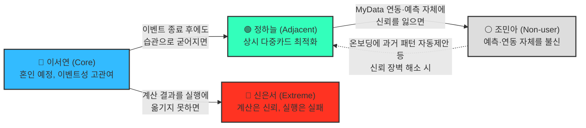
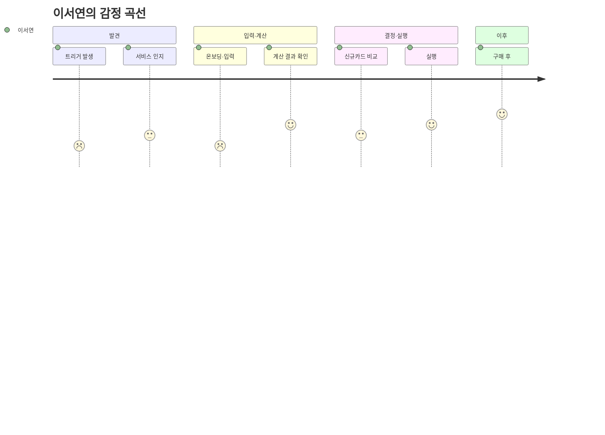
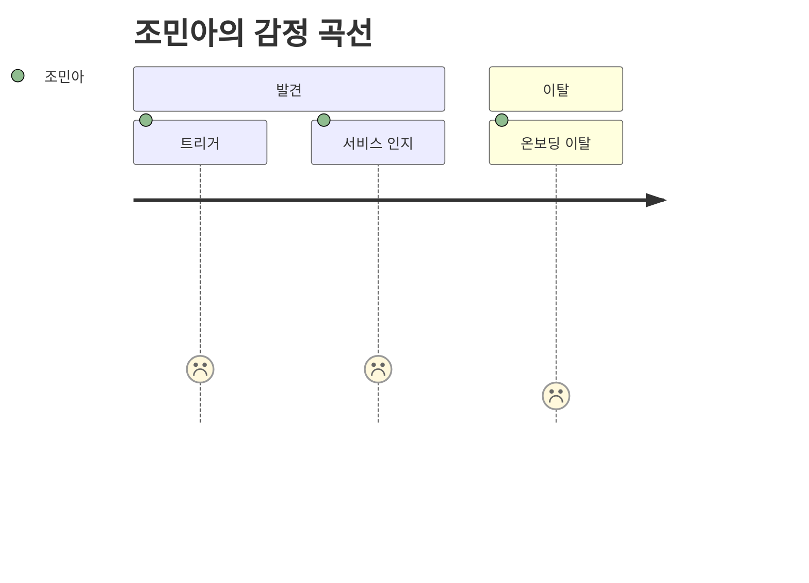
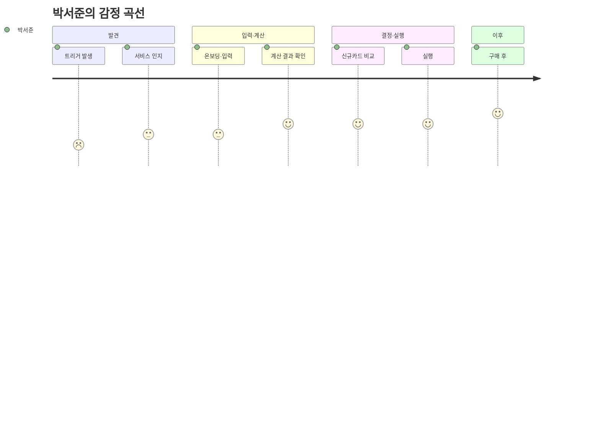
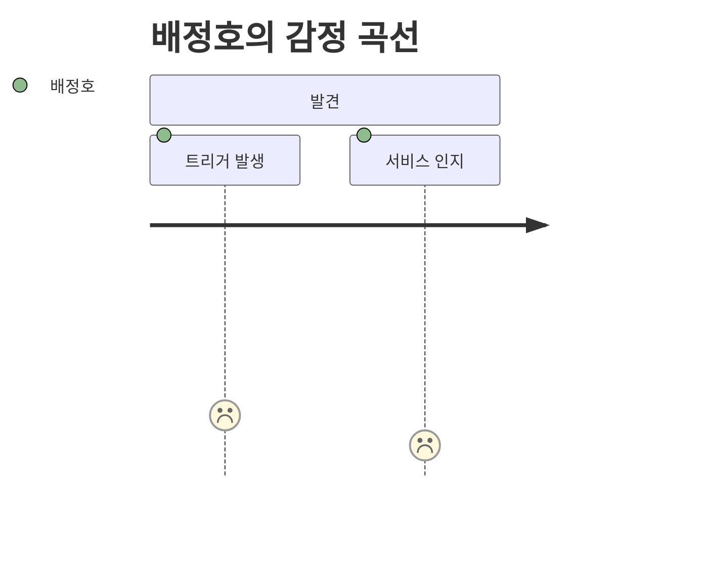

# 페르소나

> 5단계 파이프라인(스펙트럼 도출 → Convergent Filtering → Contextual Rewriting → AI Peer Review → Spectrum Map)으로 수렴시킨 대표 4명(이서연·정하늘·신은서·조민아)의 관계 구조·포지셔닝·전환 시나리오를 담은 Persona Spectrum Map입니다.
>
> **이전 버전 안내**: 이 문서는 4단계(AI Peer Review) 산출물이었던 "페르소나 검증 리포트 — 미래지출 결제설계 서비스"를 완전히 대체합니다. 검증 리포트 전문은 커밋 `2a76772`에서 확인 가능합니다.
>
> 5단계(통합, Spectrum Map)에서는 4명(이서연·정하늘·신은서·조민아)의 관계를 구조화하고 시각화해 **Persona Spectrum Map**을 완성합니다. 1~4단계(스펙트럼 도출 → Convergent Filtering → Contextual Rewriting → AI Peer Review) 전체 이력은 decision-log 2026-08-19 표에서 추적 가능합니다.

---

## 1. 관계 구조 (Mermaid)

**읽는 법**: 실선은 "서비스가 방치했을 때" 자연스럽게 이동하는 방향(Core→Adjacent는 좋은 이동, Core→Extreme·Adjacent→Non-user는 이탈 리스크), 점선은 "서비스가 개입했을 때" 되돌릴 수 있는 방향입니다.

---

## 2. 2축 포지셔닝 맵 — 신뢰도 × 관여도

| 페르소나 | 신뢰도 (미래 예측·계획을 믿는 정도) | 관여도 (카드 관리에 들이는 노력) | 위치 요약 |
| --- | --- | --- | --- |
| **정하늘** (Adjacent) | 높음 | 높음 | 우상단 — 이미 서비스가 주려는 가치를 스스로 실천 중, 자동화만 얹으면 즉시 전환 |
| **이서연** (Core) | 중간(이벤트 계기로 상승) | 중간(이벤트 기간만 일시적으로 상승) | 중앙 — Beachhead. 이벤트가 끝나면 정하늘 쪽(습관화) 또는 원점 회귀 갈림길 |
| **신은서** (Extreme) | 높음(계산은 신뢰) | 높음(계산까지는 함) → **실행 단계에서만 이탈** | 우측이나, 별도 축(실행 완료율)에서 낮음 — 3차원으로 봐야 정확 |
| **조민아** (Non-user) | 낮음 | 낮음 | 좌하단 — 신뢰·관여 모두 낮아 서비스 진입 장벽이 가장 높음 |

> 신은서는 신뢰도·관여도만으로는 정하늘과 유사한 위치에 놓이지만, **"계산 결과를 실행까지 완주하는가"**라는 제3의 축에서만 갈립니다. 2축 지도로는 표현되지 않는 이 축은 서비스가 통제할 수 없는 영역입니다 — 마이데이터 기반 서비스는 해지·전환 실행에 대한 직권·대행 권한이 없어(`윤정/확정본/02_Value_Chain.md` 5절), F-05(결제수단 배분 설계)가 이 실행 마찰에 어떤 형태로도 개입하지 않는 실제 근거입니다.

---

## 3. 서비스가 만들 수 있는 전환 시나리오

| 출발 | 도착 | 전환 조건 | 관련 기능/근거 |
| --- | --- | --- | --- |
| 이서연 (Core) | 정하늘 (Adjacent) | 혼인 이벤트에서 성공 경험 후, 카드 조합 관리를 습관으로 유지 | SAM Phase 1(Beachhead) → SAM 확장 경로와 일치 |
| 이서연 (Core) | 신은서 (Extreme) | 계산까지는 받았지만 실행(해지 등) 단계에서 상담사 만류·절차 마찰에 부딪힘 | 문제③ 해지 실행 마찰 🔵 |
| 정하늘 (Adjacent) | 조민아 (Non-user) | MyData 연동 요구·예측 방식에 대한 신뢰를 잃고 이탈 | 최근 결정(마이데이터 연동 필수, 2026-08-19 10:42) — 이 리스크가 새로 커짐 |
| 조민아 (Non-user) | 정하늘 (Adjacent)로 유입 | 온보딩에서 예측 대신 "과거 패턴 기반 초기값 자동 제안" 같은 완화장치 제공 | 4단계 검증 리포트의 F-01 보강 권고 |

> ⚠️ **신은서 → 이서연 회복 경로 없음**: 마이데이터 기반 서비스는 해지·전환 실행에 대한 직권·대행 권한이 없어(`윤정/확정본/02_Value_Chain.md` 5절 — 해지 상담·신청 대행 등 실행 지원은 어떤 형태로도 제공하지 않음), 신은서의 실행 마찰은 서비스가 개입해 해소할 수 있는 영역이 아닙니다. 이 표는 "서비스가 만들 수 있는" 전환만 다루므로 이 구간은 목록에서 제외합니다.

---

## 4. Persona Spectrum Map 요약 — 05(페르소나) 5단계 파이프라인 완료

| 단계 | 산출물 | 커밋 |
| --- | --- | --- |
| 1. 스펙트럼 도출 | 핵심 5·확장 3·극단 2·비활성 2, 총 12명 | `a81d481` |
| 2. Convergent Filtering | 유형별 대표 1명씩 4명 선별 | `b3cdc7d` |
| 3. Contextual Rewriting | 서비스 언어(F-01~F-06)로 재기술한 4종 카드 | `3d8870d` |
| 4. AI Peer Review | 3개 독립 관점 교차검증, 실존 확률 판정 | `2a76772` |
| 5. Spectrum Map (본 문서) | 4명의 관계 구조화 + 전환 시나리오 | (본 커밋) |

이 파이프라인 산출물은 06(OS)·07(JTBD) 작업의 입력으로 이어집니다.

---

**연결 문서**: `윤정/0818_쟁점정리.md`(Segment Map) · `decision-log/decision-log.md` 2026-08-19 표(마이데이터 연동 확정 10:42) · `방법론.md` 5장·7장

---

# 페르소나 스펙트럼

> Market Segment Map(`윤정/0818_쟁점정리.md` 쟁점 3, Q1~Q4·SAM Phase1/2)에 근거해 **핵심 5·확장 3·극단 2·비활성 2, 총 12명**을 이름·직무·나이·기술 수준·문제(Pain)·목표(Goal)·사용 상황(Context)·감정·대체 솔루션(Competitor)·기대 개선점(Expected Gain)까지 상세화한 독립 분석입니다. 위 "페르소나"(대표 4명 최종 통합본)와는 별개로, 스펙트럼 전체 12명을 다루는 상세 보고서입니다.
>
> 표기: 🔵 Fact(팀 근거 문서에 직접 인용) · ⚪ Inference(추정) · 🟡 Assumption(가정) — `방법론.md` 8장 기준. 12명 전원은 🟡 가상 인물입니다.

---

## 핵심(Core) — 5명 · 이상적인 주요 고객군 [매출/사용 빈도 중심]

### 1. 이서연

| 항목 | 내용 |
| --- | --- |
| 직무 / 나이 / 기술 수준 | 대기업 마케팅팀 대리 / 32세 / 중급(카드 앱은 쓰지만 혜택 계산은 서툼) |
| 현재 문제 (Pain) | 3개월 뒤 결혼, 신혼여행·혼수 지출 1,473~2,203만원(🔵)이 몰리는데 카드별 전월실적·혜택한도를 스스로 계산 못함 |
| 목표 (Goal) | 결혼 준비 지출을 카드별로 배분해 놓치는 혜택 없이 최대 혜택을 받는 것 |
| 사용 상황 · 감정 | 웨딩업체 계약 후 혼수 구매 시점에 카드 앱을 켜지만, 정보 과부하로 조급함·피로감을 느낌 |
| 대체 솔루션 (Competitor) | 뱅크샐러드 카드추천(과거 소비 기준이라 안 맞음) + 카페 후기 취합 |
| 기대 개선점 (Expected Gain) | 미래 지출을 입력하면 계산된 결제조합을 즉시 받아 의사결정 시간을 줄이는 것 |

### 2. 김도윤

| 항목 | 내용 |
| --- | --- |
| 직무 / 나이 / 기술 수준 | 스타트업 PM / 30세 / 상(엑셀·앱 설정에 능숙) |
| 현재 문제 (Pain) | 결혼과 신혼집 이사가 겹쳐 혼수·이사비용이 동시에 몰리는데, 두 이벤트를 하나의 카드 전략으로 못 묶음 |
| 목표 (Goal) | 결혼+이사 지출을 하나의 결제 계획으로 통합해 실행 순서까지 정하는 것 |
| 사용 상황 · 감정 | 이사 견적과 혼수 구매가 겹치는 주말, 압박감과 "따로 계산하기 귀찮다"는 회피감 |
| 대체 솔루션 (Competitor) | 개인 엑셀 가계부에 카드별 실적을 수기로 추적 |
| 기대 개선점 (Expected Gain) | 여러 이벤트가 겹쳐도 하나의 화면에서 통합 시나리오로 비교하는 것 |

### 3. 박서준

| 항목 | 내용 |
| --- | --- |
| 직무 / 나이 / 기술 수준 | 중소기업 영업직 / 34세 / 중(새 서비스 학습에 시간 필요) |
| 현재 문제 (Pain) | 혼수 목돈 지출 시 전월실적 구간을 못 채워 혜택을 놓침, 카드사 "단종카드 자동대체" 후 혜택 불일치 경험(🔵 민원 2022→2025 88.4%↑) |
| 목표 (Goal) | 카드사의 일방적 자동대체에 끌려가지 않고 스스로 검증한 근거로 카드를 정하는 것 |
| 사용 상황 · 감정 | 자동대체 안내 문자를 받고 대체 카드 혜택을 확인할 때, 억울함과 카드사에 대한 불신 |
| 대체 솔루션 (Competitor) | 카드사 콜센터 상담(설명이 상충되어 신뢰 안 감) |
| 기대 개선점 (Expected Gain) | 자동대체 전에 계산 근거를 먼저 보여줘 스스로 판단할 시간을 주는 것 |

### 4. 한지민

| 항목 | 내용 |
| --- | --- |
| 직무 / 나이 / 기술 수준 | 프리랜서 번역가 / 36세 / 중(회계 앱은 능숙, 카드 혜택 비교는 서툼) |
| 현재 문제 (Pain) | 전세→자가 입주로 가전·인테리어 지출이 몰리는데, 소득이 일정하지 않아 실적 구간 맞추기가 더 어려움 |
| 목표 (Goal) | 이사 기간 한정 지출에 맞춰 카드 조합을 임시로 바꿨다가, 끝나면 원래대로 되돌리는 것 |
| 사용 상황 · 감정 | 가전 구매 직전, 이번 달 소득이 불확실한 상태에서 계획을 세울 때 불안함과 통제 욕구 |
| 대체 솔루션 (Competitor) | 카드고릴라에서 스펙만 비교, 실행은 감으로 결정 |
| 기대 개선점 (Expected Gain) | 소득이 불확실해도 시나리오별(최소/평균) 계산 결과를 받아보는 것 |

### 5. 최유리

| 항목 | 내용 |
| --- | --- |
| 직무 / 나이 / 기술 수준 | 대기업 회계팀 과장 / 39세 / 상(엑셀·수치 분석에 능숙) |
| 현재 문제 (Pain) | 지방 발령으로 갑작스러운 이사, 가전·인테리어 지출과 통근 교통비 패턴까지 바뀌어 카드 혜택 구조 전체 재검토 필요 |
| 목표 (Goal) | 회계 업무 경험을 살려 스스로 검증할 수 있는 계산 결과를 받는 것 |
| 사용 상황 · 감정 | 발령 통보 후 짧은 시간 안에 계획을 다시 짜야 할 때, 시간 압박과 "대충 넘어가지 못하는" 답답함 |
| 대체 솔루션 (Competitor) | 본인 엑셀 시뮬레이션(시간이 오래 걸려 자주 포기) |
| 기대 개선점 (Expected Gain) | 직접 하던 시뮬레이션을 서비스가 대신 계산해 시간을 아껴주는 것 |

---

## 확장(Adjacent) — 3명 · 유사 문제를 가진 인접 시장군 [핵심 질문: "유사한 제품/서비스를 사용하고 있는 사람은 누구인가?"]

### 6. 정하늘

| 항목 | 내용 |
| --- | --- |
| 직무 / 나이 / 기술 수준 | 신입 회계사 / 27세 / 상(카드 혜택 커뮤니티 활동, 스프레드시트 자체 제작) |
| 현재 문제 (Pain) | "PIVOT"(🔵 다중카드 병행 트렌드)처럼 여러 카드를 이미 병행 사용 중이지만, 매달 실적·한도를 직접 계산하느라 시간이 많이 듦 |
| 목표 (Goal) | 이미 하고 있는 수작업 최적화를 자동 계산으로 대체해 시간을 아끼는 것 |
| 사용 상황 · 감정 | 매달 말 카드별 실적을 확인하며 다음 달 카드를 재배치할 때, 뿌듯함과 반복 작업의 번거로움이 공존 |
| 대체 솔루션 (Competitor) | 카드 혜택 커뮤니티(카드고릴라 카페) + 개인 스프레드시트 |
| 기대 개선점 (Expected Gain) | 수작업 계산 시간을 없애고, 이미 아는 것보다 더 정교한 조합을 제안받는 것 |

### 7. 오세훈

| 항목 | 내용 |
| --- | --- |
| 직무 / 나이 / 기술 수준 | 이직한 개발자 / 32세 / 상(IT 직군) |
| 현재 문제 (Pain) | 이직으로 소득·출퇴근·식비 패턴이 바뀌었지만 특정 "이벤트"로 분류되지 않아 기존 카드 추천 서비스들이 이 변화를 반영 못함 |
| 목표 (Goal) | 혼인·이사 같은 정해진 이벤트가 아니어도, 스스로 입력한 소비 변화만으로 카드 조합을 재설계받는 것 |
| 사용 상황 · 감정 | 이직 후 첫 급여를 받고 지출 패턴이 달라졌음을 체감할 때, 소외감("내 상황은 카테고리에 없다")과 답답함 |
| 대체 솔루션 (Competitor) | 기존 카드를 바꾸지 않고 방치, 가끔 지인에게 카드 추천 요청 |
| 기대 개선점 (Expected Gain) | 이벤트명이 아니라 입력한 지출 변화값만으로도 서비스가 반응해주는 것 |

### 8. 강민재

| 항목 | 내용 |
| --- | --- |
| 직무 / 나이 / 기술 수준 | 자영업자 / 55세 / 중(스마트폰 뱅킹은 쓰지만 신규 앱 학습은 느림) |
| 현재 문제 (Pain) | 자녀 독립 이후 생활비 지출이 줄었는데, 기존 서비스는 지출이 "늘어나는" 상황만 가정해 본인 케이스(지출 감소)에 안 맞음 |
| 목표 (Goal) | 지출이 줄어드는 방향의 변화도 반영해 불필요해진 카드를 정리하고 싶은 것 |
| 사용 상황 · 감정 | 자녀 독립 후 연회비 청구서를 보며 "이 카드가 아직도 필요한가"를 고민할 때, 허탈함과 막연함 |
| 대체 솔루션 (Competitor) | 특별한 도구 없이 카드사 안내 문자만 보고 개별 판단 |
| 기대 개선점 (Expected Gain) | 지출 감소 상황도 입력하면 "정리해도 되는 카드"를 짚어주는 것 |

---

## 극단(Extreme) — 2명 · 제약·극단적 상황을 가진 사용자 [핵심 질문: "가장 자주 실패를 경험하는 사람은 누구인가?"]

### 9. 윤태호

| 항목 | 내용 |
| --- | --- |
| 직무 / 나이 / 기술 수준 | 회사원(관리직) / 44세 / 하(앱 최소 기능만 사용, 신규 서비스 학습 의지 낮음) |
| 현재 문제 (Pain) | 카드 20장 이상을 보유한 헤비유저 — 조합이 너무 복잡해져 스스로 관리를 포기한 상태 |
| 목표 (Goal) | 손대지 않고 방치한 카드들까지 포함해 전체를 한 번에 정리·재배치하는 것 |
| 사용 상황 · 감정 | 연말정산 시즌 명세서를 몰아서 보다가 안 쓰는 카드를 발견할 때, 무력감("이미 늦었다")과 관리 자체에 대한 회피 |
| 대체 솔루션 (Competitor) | 안 쓰는 카드는 서랍에 방치, 연회비만 내는 카드가 다수 |
| 기대 개선점 (Expected Gain) | 20장이 넘는 규모도 한 번에 스캔해 우선순위를 매겨주는 것 |

### 10. 신은서

| 항목 | 내용 |
| --- | --- |
| 직무 / 나이 / 기술 수준 | 직장인 / 29세 / 중(계산은 잘하지만 실행 단계에서 막힘) |
| 현재 문제 (Pain) | 계산상 해지가 유리한데도 상담사 만류·절차 복잡으로 실제 해지에 3번 실패(🔵 문제③ 해지 실행 마찰과 동일 패턴) |
| 목표 (Goal) | 계산 결과뿐 아니라 실행(해지) 자체를 끝까지 완수하는 것 |
| 사용 상황 · 감정 | 해지 전화를 걸었다가 상담사 만류에 끊고 난 뒤, 좌절감과 "노력해도 안 바뀐다"는 무력감 |
| 대체 솔루션 (Competitor) | 해지 시도 후 포기, 자동이체만 걸어둔 채 방치 |
| 기대 개선점 (Expected Gain) | 계산 근거를 믿고 실행(해지)까지 흔들림 없이 완주하는 것 |

---

## 비활성(Non-user) — 2명 · 아직 사용하지 않거나 회피하는 집단 [핵심 질문: "이 제품/서비스를 사용할 수 없는 사람은 누구인가?"]

### 11. 배정호

| 항목 | 내용 |
| --- | --- |
| 직무 / 나이 / 기술 수준 | 자영업자 / 62세 / 하(체크카드·현금 위주, 앱 사용 자체가 낯섦) |
| 현재 문제 (Pain) | 신용카드보다 체크카드·현금을 주로 쓰고, 스마트폰 앱으로 미래 지출을 입력하는 방식 자체가 익숙하지 않음(🔵 반박2 — 디지털 비친화 인구) |
| 목표 (Goal) | 복잡한 앱 조작 없이 지금 방식 그대로 큰 불편 없이 지내는 것(서비스 자체가 목표가 아님) |
| 사용 상황 · 감정 | 가족이 앱을 권했을 때 잠깐 열어봤다가 입력 항목이 많아 바로 닫음, 무관심과 새 앱 학습에 대한 거부감 |
| 대체 솔루션 (Competitor) | 종이 가계부, 은행 창구 방문 상담 |
| 기대 개선점 (Expected Gain) | (본인은 필요성을 못 느낌) — 입력 없이 결과부터 보여주는 극단적 단순화가 있어야 접점이 생김 |

### 12. 조민아

| 항목 | 내용 |
| --- | --- |
| 직무 / 나이 / 기술 수준 | 프리랜서 / 26세 / 중(앱 사용은 능숙하나 서비스의 전제를 신뢰 안 함) |
| 현재 문제 (Pain) | 몇 달 앞선 미래 소비를 예측해서 입력하는 것 자체가 비현실적이라고 생각(🟡 "가장 큰 가정" 붕괴 케이스 — 더쎈카드 종료 리스크와 동일 우려) |
| 목표 (Goal) | 미래를 예측하기보다 그때그때 상황에 맞게 대응하는 것으로 충분하다고 느낌 |
| 사용 상황 · 감정 | 친구가 서비스 얘기를 꺼냈을 때 "그런 걸 어떻게 미리 아냐"며 대화를 넘김, 회의감과 서비스에 대한 불신 |
| 대체 솔루션 (Competitor) | 지인이 추천한 카드 1장만 계속 사용, 별도 최적화 안 함 |
| 기대 개선점 (Expected Gain) | (본인은 필요성을 못 느낌) — 예측 대신 "과거 패턴 기반 자동 제안"처럼 예측 부담을 없애는 방향이 필요함 |

---

## 요약

| 유형 | 인원 | 생성 포인트 | 이 세그먼트에서 뽑은 인물 |
| --- | --- | --- | --- |
| 핵심(Core) | 5 | 매출/사용 빈도 중심 | 이서연·김도윤·박서준·한지민·최유리 (Q1 혼인·Q2 이사) |
| 확장(Adjacent) | 3 | 유사 니즈/다른 맥락 | 정하늘(기존 서비스 이용자)·오세훈·강민재(SAM Phase 2, 이벤트 비종속) |
| 극단(Extreme) | 2 | 실패·불편·대안 사용 중심 | 윤태호(카드 과다보유)·신은서(문제③ 해지 실행 마찰) |
| 비활성(Non-user) | 2 | 인식·가치·신뢰 결여 중심 | 배정호(반박2 디지털 비친화)·조민아(가장 큰 가정 붕괴) |

---

**연결 문서**: `윤정/0818_쟁점정리.md`(쟁점 3, Segment Map) · `효진/컨설팅 전 1페이지 브리프.md`(문제③, 가장 큰 가정) · `가람/0819/페르소나.md`(별도 5단계 파이프라인·4명 대표 최종본) · `방법론.md` 5장·8장

---

# 고객 여정지도

> `가람/0819/고객 여정지도 작성 방법론.md`의 절차(4단계: 이 서비스 고유의 핵심 단계 정의)에 따라, 범용 이커머스 여정 템플릿을 그대로 쓰지 않고 F-01~F-06 기능 흐름에 맞춘 **7단계**(트리거 발생→서비스 인지→온보딩·입력→계산 결과 확인→신규카드 비교→실행→구매 후)로 12명 전원의 여정과 감정 곡선을 정리했습니다. 1~4절은 `가람/0819/페르소나 스펙트럼 분석 보고서.md`의 12명 중 대표 4명(**이서연·정하늘·신은서·조민아**)의 여정이고, 5~12절은 나머지 8명(김도윤·박서준·한지민·최유리·오세훈·강민재·윤태호·배정호) 개별 여정을 같은 형식으로 추가한 것입니다 — 12명 전원의 여정을 이 한 문서에서 확인할 수 있습니다.
>
> **이 서비스 고유의 7단계**: ① 트리거 발생 → ② 서비스 인지 → ③ 온보딩·입력(F-01·F-02) → ④ 계산 결과 확인(F-03·F-06) → ⑤ 신규카드 비교(F-04) → ⑥ 실행(F-05) → ⑦ 구매 후. 조민아·신은서·윤태호·배정호는 중간 단계에서 여정이 끊기거나 실패하며, 이 단절 자체가 각자의 핵심 Pain Point입니다.
>
> 각 인물 표 바로 아래에 **Mermaid `journey` 다이어그램**(감정 곡선, 1=최저·5=최고)을 추가해 GitHub에서 파일을 열면 바로 시각화된 그래프로 보입니다. 참고용 원본 이미지(가구 시장 CJM)처럼 페르소나·시나리오 카드를 색깔 있는 보드 형태로 배치하는 것은 GitHub 마크다운이 임의 HTML/CSS 레이아웃을 렌더링하지 않아 그대로 재현할 수 없고, Mermaid가 지원하는 `journey` 다이어그램(단계+감정 곡선)이 GitHub에서 실제로 그려지는 가장 가까운 형태입니다.

---

## 1. 이서연의 여정 (Core형 — 혼인 예정, 5명 대표)

| 단계 | 행동 | 생각 | 감정 | Pain Point |
| --- | --- | --- | --- | --- |
| ① 트리거 발생 | 웨딩홀 계약, 혼수 리스트 작성 시작 | "돈 나갈 데가 한꺼번에 몰리는데 어떻게 대비하지" | 설렘 + 막막함 | 다가올 지출 규모를 카드 혜택과 연결해 계산할 방법이 없음 |
| ② 서비스 인지 | "카드 조합 미리 짜기" 검색, 서비스 발견 | "이런 서비스가 있었네, 한번 해볼까" | 기대와 의심이 공존 | 기존 카드추천 앱은 전부 과거 소비 기준이라 신뢰가 안 감 |
| ③ 온보딩·입력 | 마이데이터 연동 동의, 카테고리별 미래 지출 입력 | "이걸 다 입력해야 하나, 정확하면 낫겠지" | 약간의 피로감 | 마이데이터 연동 단계의 개인정보 제공 망설임(이탈 리스크) |
| ④ 계산 결과 확인 | 카드별 결제조합과 계산 근거 확인 | "왜 이렇게 나왔는지 이해가 되네" | 안도, 신뢰 형성 | 계산 근거가 불투명하면 여기서 바로 이탈 |
| ⑤ 신규카드 비교 | 기존카드 유지안 vs 신규카드 포함안 비교 | "신규카드까지 만들 필요는 있나" | 신중함 | 불필요한 신규카드 추천으로 보일까 봐 경계 |
| ⑥ 실행 | 결제조합대로 사용처 재배치, 필요시 해지 신청 | "이대로만 하면 되겠지" | 실행 의지 | 해지 단계에서 상담사 만류를 만나면 실행이 막힘(→ 신은서처럼 실행 실패로 이어질 수 있음) |
| ⑦ 구매 후 | 다음 달 실제 혜택 결과 확인 | "계산한 대로 혜택을 받았네" | 만족, 재사용 의향 | 결혼 이벤트가 끝나면 계속 쓸 이유가 약해짐(습관화 실패 시 이탈) |

## 2. 정하늘의 여정 (Adjacent형 — 상시 다중카드 최적화, 3명 대표)

| 단계 | 행동 | 생각 | 감정 | Pain Point |
| --- | --- | --- | --- | --- |
| ① 트리거 발생 | 매달 카드 실적을 스프레드시트로 직접 확인 | "이거 매달 반복하기 너무 귀찮다" | 피로감, 익숙함 | 이미 하고 있는 수작업을 대체할 도구가 없음 |
| ② 서비스 인지 | 카드 커뮤니티에서 서비스 언급을 봄 | "내가 하는 걸 자동으로 해준다고?" | 호기심 | 내 복잡한 다중카드 조합도 처리할 수 있을지 의구심 |
| ③ 온보딩·입력 | 보유한 다수 카드를 전부 등록 | "카드가 많아서 입력이 오래 걸리네" | 약간의 번거로움 | 카드 개수가 많을수록 입력 부담이 커짐 |
| ④ 계산 결과 확인 | 본인이 손으로 짠 조합과 서비스 결과를 비교 | "어, 내가 놓친 조합이 있었네" | 놀라움, 신뢰 상승 | 본인 계산과 결과가 다르면 어느 쪽을 믿을지 혼란 |
| ⑤ 신규카드 비교 | 이미 카드가 많아 신규카드 제안은 대부분 스킵 | "이 이상 카드를 늘리고 싶진 않다" | 방어적 태도 | 신규카드 위주 추천이면 바로 이탈 |
| ⑥ 실행 | 매달 우선순위만 서비스 안내대로 갱신 | "이제 스프레드시트 안 만들어도 되겠다" | 해방감 | 자동 갱신이 카드사 정책 변경을 못 따라가면 신뢰 붕괴 |
| ⑦ 구매 후 | 매달 재방문해 습관적으로 사용 | "이건 계속 쓸 만하다" | 만족, 충성도 형성 | (성공 케이스) 다만 업데이트가 느리면 다시 수작업으로 회귀 |

## 3. 신은서의 여정 (Extreme형 — 계산은 신뢰, 실행은 실패, 2명 대표)

| 단계 | 행동 | 생각 | 감정 | Pain Point |
| --- | --- | --- | --- | --- |
| ① 트리거 발생 | 카드 혜택 조건 변경 안내를 받음 | "이 카드 이제 나한테 안 맞는 것 같은데" | 찜찜함 | 변경 시점을 스스로 알아채기 어려움 |
| ② 서비스 인지 | 이서연과 마찬가지로 서비스를 발견해 이용 시작 | "일단 계산부터 해보자" | 기대 | (이서연의 여정과 동일 — Pain Point 없음) |
| ③ 온보딩·입력 | 마이데이터 연동, 미래 지출 입력 | "이걸로 뭐가 달라지는지 보자" | 담담함 | (이서연의 여정과 동일 — Pain Point 없음) |
| ④ 계산 결과 확인 | 계산 결과 "해지가 유리함"을 확인 | "역시 해지하는 게 맞구나" | 확신 | (이 단계까지는 순조로움 — Pain Point 없음) |
| ⑤ 신규카드 비교 | 신규카드 없이 기존 카드 정리만으로 충분하다고 판단 | "새 카드까지는 필요 없겠다" | 담백함 | (Pain Point 없음) |
| ⑥ 실행(해지 시도) | 콜센터에 해지 전화 | "그냥 해지해주면 될 텐데" | 기대 | 상담사의 만류·전환유도 화법에 부딪힘 |
| ⑥ 실행 결과(실패) | 통화를 끊고 해지를 포기 | "이럴 줄 알았으면 그냥 두는 게 나았나" | 좌절감, 무력감 | **계산 결과를 실행까지 완주하지 못하는 것 자체가 신은서의 핵심 Pain Point** |
| ⑦ 구매 후(반복 방치) | 자동이체만 걸어두고 다음 알림까지 방치 | "다음엔 진짜 해야지"(반복됨) | 체념 섞인 답답함 | 서비스가 계산은 도와줘도 실행의 사회적 마찰까지는 해결 못 함(F-05 스코프 한계) |

## 4. 조민아의 여정 (Non-user형 — 예측 자체를 불신, 2명 대표)

| 단계 | 행동 | 생각 | 감정 | Pain Point |
| --- | --- | --- | --- | --- |
| ① 트리거(막연한 필요) | 지인이 서비스를 언급 | "그런 게 왜 필요하지" | 무관심 | 미래 지출을 예측해야 한다는 전제 자체에 공감하지 못함 |
| ② 서비스 인지(짧은 탐색) | 앱을 잠깐 열어봄 | "몇 달 뒤를 어떻게 미리 알아, 그때그때 하면 되지" | 회의감 | 온보딩 화면에서 "미래 지출 입력"을 요구받는 순간 바로 이탈 |
| ③ 온보딩 이탈 | 앱을 닫고 지인 추천 카드 1장 그대로 사용 | "굳이 이런 걸 써야 하나" | 불신 | 예측에 대한 근본적 불신이 온보딩 완화장치 없이는 해소되지 않음 |
| ④ 계산 결과 확인 이후 단계 | 조민아는 여기까지 도달하지 않음 | — | — | **조민아가 온보딩(③ 단계)에서 멈추는 것 자체가 이 유형의 존재 이유** — F-01 전제의 실패 조건을 보여줌 |

---

## 5. 김도윤의 여정 (Core형 — 결혼+이사 동시 진행)

| 단계 | 행동 | 생각 | 감정 | Pain Point |
| --- | --- | --- | --- | --- |
| ① 트리거 발생 | 결혼식과 신혼집 이사 날짜가 한 달 차이로 겹침을 확인 | "이 둘을 따로 계산하면 답이 안 나온다" | 압박감 | 두 이벤트 지출이 동시에 몰릴 때 하나의 계획으로 통합해서 볼 방법이 없음 |
| ② 서비스 인지 | 검색 중 서비스 발견, PM 특성상 여러 서비스 비교 | "이게 두 이벤트를 한 번에 계산해줄까" | 기대와 의구심 | 대부분의 카드추천 서비스가 단일 이벤트 기준이라 복합 상황을 다룰지 불확실 |
| ③ 온보딩·입력 | 결혼·이사 지출을 각각 카테고리로 입력 | "입력 항목이 많긴 한데 한 번에 되니 낫다" | 안도 섞인 피로 | 두 이벤트 지출을 따로 입력해야 해서 "통합"이 실제로는 입력자 몫으로 남음 |
| ④ 계산 결과 확인 | 통합 시나리오로 계산된 결과 확인 | "이제서야 전체 그림이 보이네" | 안도 | 없음 |
| ⑤ 신규카드 비교 | 신규카드 포함/미포함 시나리오 비교 | "일단 있는 카드로 최대한 써보자" | 신중함 | 없음 |
| ⑥ 실행 | 결제조합대로 카드 사용처 재배치 | "복잡했는데 실행은 단순해졌다" | 만족 | 없음 |
| ⑦ 구매 후 | 두 이벤트 지출 후 실제 혜택 확인 | "다음에 큰 지출 있을 때도 써야겠다" | 만족, 재사용 의향 | 두 이벤트가 끝나면 "복합 이벤트 통합"이라는 핵심 가치를 다시 쓸 계기가 줄어듦 |

## 6. 박서준의 여정 (Core형 — 자동대체 불신에서 출발)

| 단계 | 행동 | 생각 | 감정 | Pain Point |
| --- | --- | --- | --- | --- |
| ① 트리거 발생 | 카드사로부터 "단종카드 자동대체" 안내 문자를 받음 | "또 내 마음대로 바뀌는구나" | 억울함 | 자동대체 전에 미리 확인할 방법이 없음 |
| ② 서비스 인지 | 자동대체된 카드의 혜택이 이상해서 검색하다 서비스 발견 | "이번엔 내가 직접 계산해봐야겠다" | 불신 섞인 기대 | 카드사 설명과 실제 혜택이 달라 무엇을 믿어야 할지 혼란 |
| ③ 온보딩·입력 | 혼수 지출과 보유카드 입력 | "이번엔 내가 직접 확인한다" | 결심 | 없음 |
| ④ 계산 결과 확인(F-06) | 계산 근거를 하나하나 확인 | "이거 봐, 자동대체보다 이 카드가 나은데" | 확신, 카드사에 대한 불신 재확인 | 근거가 명확하지 않았다면 자동대체를 그냥 믿었을 뻔했다는 자각 |
| ⑤ 신규카드 비교 | 자동대체된 카드 대신 다른 대안 비교 | "자동대체보다 나은 선택지가 있었네" | 안도 | 없음 |
| ⑥ 실행 | 자동대체된 카드를 다시 변경 신청 | "이번엔 내가 정한 대로 간다" | 주도감 | 카드사 콜센터를 다시 거쳐야 해서 이전과 같은 불편을 반복할 위험 |
| ⑦ 구매 후 | 새 조합으로 다음 달 혜택 확인 | "이제 자동대체 문자가 와도 겁 안 난다" | 만족, 신뢰 회복 | 카드사가 또 조건을 바꾸면 처음부터 다시 확인해야 함(반복 비용) |

## 7. 한지민의 여정 (Core형 — 소득 불규칙 프리랜서, 이사)

| 단계 | 행동 | 생각 | 감정 | Pain Point |
| --- | --- | --- | --- | --- |
| ① 트리거 발생 | 전세 계약 종료, 자가 입주 확정 | "가전 살 돈은 있는데 이번 달 수입이 들쭉날쭉해서 걱정" | 불안 | 소득이 일정하지 않아 카드 실적 구간을 맞출 수 있을지 예측 불가 |
| ② 서비스 인지 | 카드고릴라에서 스펙만 보다가 서비스 발견 | "이건 내 불규칙한 소득 상황도 감안해줄까" | 조심스러운 기대 | 대부분 서비스가 소득 안정을 전제로 계산해 본인 상황과 안 맞을까 우려 |
| ③ 온보딩·입력 | 이사 지출과 예상 소득 범위(최소~평균)를 함께 입력 | "범위로 입력할 수 있어서 다행이다" | 안도 | 소득이 불확실할 때 단일 숫자로만 입력해야 한다면 이 단계에서 이탈할 위험 |
| ④ 계산 결과 확인 | 최소/평균 소득 시나리오별 결과 확인 | "최악의 경우에도 이 카드면 되겠다" | 안심 | 없음 |
| ⑤ 신규카드 비교 | 신규카드 없이 기존 카드 우선순위만 조정 | "지금은 안전하게 가자" | 신중함 | 없음 |
| ⑥ 실행 | 가전 구매 시점에 맞춰 카드 사용 순서 조정 | "계획대로 쓰면 되겠다" | 통제감 | 실제 소득이 예상보다 낮으면 계획을 다시 짜야 하는 부담 |
| ⑦ 구매 후 | 이사 마무리 후 카드 조합을 원래대로 되돌림 | "필요할 때만 바꿔 쓰면 되는구나" | 만족 | 조합을 되돌리는 과정도 다시 입력해야 해서 번거로움이 남음 |

## 8. 최유리의 여정 (Core형 — 발령, 회계 전문가)

| 단계 | 행동 | 생각 | 감정 | Pain Point |
| --- | --- | --- | --- | --- |
| ① 트리거 발생 | 지방 발령 통보, 짧은 시간 안에 이사 확정 | "이럴 시간이 없는데 소비 구조를 다 다시 짜야 하네" | 시간 압박 | 발령처럼 갑작스러운 이벤트는 준비할 시간이 극히 짧음 |
| ② 서비스 인지 | 평소 엑셀로 하던 시뮬레이션을 대신해줄 도구를 검색하다 발견 | "이게 내가 하던 계산을 대신해준다면 시간을 아끼겠다" | 실용적 기대 | 회계 전문가라 스스로 검증 안 된 계산 결과는 못 믿음 |
| ③ 온보딩·입력 | 통근·가전 등 바뀔 지출 카테고리를 빠르게 입력 | "입력은 빠른데, 계산 방식이 맞는지 봐야겠다" | 분석적 경계 | 없음 |
| ④ 계산 결과 확인(F-06) | 계산 근거를 회계 지식으로 직접 검증 | "이 계산식, 내가 하던 것과 같은 논리네" | 신뢰 형성 | 근거가 부실하면 바로 신뢰를 잃고 본인 엑셀로 돌아갈 사람 |
| ⑤ 신규카드 비교 | 발령지 기준 통근·생활 패턴에 맞는 카드 비교 | "발령지 사정까지 반영되네" | 만족 | 없음 |
| ⑥ 실행 | 발령 전 남은 시간 안에 카드 재배치 완료 | "시간 안에 끝냈다" | 안도 | 없음 |
| ⑦ 구매 후 | 발령지 정착 후 실제 절감 효과 확인 | "이제 엑셀 없이도 되겠다" | 만족, 신뢰 지속 | 다음 갑작스러운 변화가 생겼을 때도 이만큼 빠르게 대응해줄지 확신은 아직 없음 |

## 9. 오세훈의 여정 (Adjacent형 — 이직, 이벤트 비종속)

| 단계 | 행동 | 생각 | 감정 | Pain Point |
| --- | --- | --- | --- | --- |
| ① 트리거 발생 | 이직 후 첫 급여, 달라진 소득·출퇴근·식비 패턴을 체감 | "뭔가 달라졌는데 뭘 어떻게 바꿔야 할지 모르겠다" | 소외감 | 혼인·이사 같은 "이벤트명"이 없어 본인 상황을 서비스가 이해할지 확신 없음 |
| ② 서비스 인지 | 지인 추천으로 서비스를 접함 | "이거 이벤트가 있어야 쓰는 거 아닌가" | 반신반의 | 마케팅이 혼인·이사 위주라 본인 같은 케이스는 대상이 아닌 것처럼 보임 |
| ③ 온보딩·입력 | 이벤트명 없이 카테고리별 지출 변화값만 직접 입력 | "이벤트 이름을 안 물어보네, 그냥 숫자만 넣으면 되는구나" | 안도 | 입력 화면이 "이벤트 선택"을 강요했다면 이 단계에서 바로 이탈했을 것 |
| ④ 계산 결과 확인 | 입력한 변화값 기준으로 결과 확인 | "내 상황도 다뤄주는구나" | 신뢰 상승 | 없음 |
| ⑤ 신규카드 비교 | 새 통근·식비 패턴에 맞는 카드 비교 | "이 카드가 지금 패턴에 더 맞네" | 만족 | 없음 |
| ⑥ 실행 | 카드 우선순위 재배치 | "지인한테도 알려줘야겠다" | 만족 | 없음 |
| ⑦ 구매 후 | 다음 소득·지출 변화가 생기면 다시 쓸 의향 | "이벤트가 없어도 또 쓸 수 있겠다" | 충성도 형성 | 없음(성공 케이스 — SAM Phase 2 확장 채널의 근거) |

## 10. 강민재의 여정 (Adjacent형 — 자녀 독립, 지출 감소)

| 단계 | 행동 | 생각 | 감정 | Pain Point |
| --- | --- | --- | --- | --- |
| ① 트리거 발생 | 자녀 독립 후 첫 연회비 청구서를 받음 | "이 카드가 아직도 필요한가" | 허탈함 | 기존 서비스는 지출이 "늘어나는" 상황만 가정해 본인 케이스(감소)엔 안 맞다고 생각 |
| ② 서비스 인지 | 스마트폰 뱅킹 알림에서 서비스 광고를 봄 | "이것도 어차피 새 카드 팔려는 거 아닌가" | 경계심 | 신규 앱 학습에 대한 낮은 의지 |
| ③ 온보딩·입력 | 자녀 독립으로 줄어든 생활비 지출을 입력 | "지출이 준다고 입력해도 되는구나" | 의외라는 반응 | 지출 "증가"만 입력할 수 있는 화면이었다면 여기서 이탈했을 것 |
| ④ 계산 결과 확인 | "정리해도 되는 카드" 목록 확인 | "이 카드는 진짜 필요 없었네" | 후련함 | 없음 |
| ⑤ 신규카드 비교 | 신규카드 제안 없이 정리만 제시받음 | "괜히 새 카드 팔려는 게 아니었구나" | 신뢰 | 없음 |
| ⑥ 실행 | 연회비만 나가던 카드 해지 | "속이 시원하다" | 만족 | 없음(단, 해지 자체의 상담사 마찰 리스크는 신은서와 공유) |
| ⑦ 구매 후 | 연회비 절감 체감 | "이런 것도 되는구나, 주변에도 알려야겠다" | 만족 | 없음 |

## 11. 윤태호의 여정 (Extreme형 — 카드 20장+, 관리 포기)

| 단계 | 행동 | 생각 | 감정 | Pain Point |
| --- | --- | --- | --- | --- |
| ① 트리거 발생 | 연말정산 시즌, 명세서를 몰아보다 안 쓰는 카드를 발견 | "이걸 언제 다 정리하나" | 무력감 | 카드 수가 너무 많아 손대는 것 자체가 부담 |
| ② 서비스 인지 | 가족의 권유로 서비스를 알게 됨 | "이 정도 규모도 되려나" | 회의적 기대 | 서비스가 소수 카드 사용자 기준일 거라는 선입견 |
| ③ 온보딩·입력 | 20장 넘는 카드를 하나씩 등록 | "등록만 벌써 한참 걸리네" | 지침 | 카드 개수가 많을수록 입력 부담이 기하급수적으로 커짐 |
| ④ 계산 결과 확인 | 카드별 우선순위가 매겨진 결과를 받음 | "이렇게 정리해서 보여주니 그나마 낫다" | 약간의 안도 | 그래도 실행해야 할 항목(해지·정리)이 한 번에 너무 많이 나옴 |
| ⑤ 신규카드 비교 겸 정리 우선순위 검토 | 카드별 처리 방안을 쭉 훑어봄 | "이걸 한 번에 다 처리할 자신이 없다" | 압도됨 | **결과를 받고도 실행 단계로 못 넘어가는 것 자체가 윤태호의 핵심 Pain Point** — 정보 과부하로 인한 실행 포기 |
| ⑥ 실행(미실행) | 결과를 받은 채로 며칠 뒤 앱을 다시 열지 않음 | "나중에 시간 날 때 하자"(반복됨) | 회피 | 계산과 우선순위 제공만으로는 "실행 규모" 자체의 부담을 못 줄임 |
| ⑦ 구매 후 | 다음 해 연말정산에서 같은 상황 반복 | "작년에도 이랬는데" | 체념 | 서비스가 "정리해야 할 양"을 단계적으로 쪼개주지 않으면 이 유형은 계속 이탈 |

## 12. 배정호의 여정 (Non-user형 — 디지털 비친화)

| 단계 | 행동 | 생각 | 감정 | Pain Point |
| --- | --- | --- | --- | --- |
| ① 트리거 발생 | 가족이 "이런 앱도 있다"며 스마트폰을 보여줌 | "굳이 이런 걸 써야 하나" | 무관심 | 체크카드·현금 위주라 카드 조합 최적화라는 문제 자체를 못 느낌 |
| ② 서비스 인지(매우 짧음) | 가족이 앱을 대신 설치해 잠깐 화면을 보여줌 | "화면에 뭐가 이렇게 많아" | 부담감 | 입력 항목이 많은 화면을 보는 순간 바로 거부감 |
| ③ 이후 단계 해당 없음 | 화면을 보다가 바로 앱을 닫아달라고 함, 이후 종이 가계부·창구 상담 유지 | "그냥 하던 대로 할란다" | 거부감 | **배정호가 온보딩을 시도조차 하지 않는 것 자체가 이 유형의 존재 이유** — 조민아(③에서 이탈)보다도 이른 ② 단계에서 이탈, 디지털 채널 자체에 대한 거부가 F-01 이전 단계에서 이미 진입을 막음 |

---

## 13. 12명 전체 여정 간 공통 관찰

- **가장 취약한 전환점은 ②~③(서비스 인지·온보딩)과 ⑥(실행)**: ②에서 배정호가, ③에서 조민아가 이탈하고, ⑥에서는 이서연도 신은서·윤태호처럼 실행에 실패할 위험이 있음
- **F-06(계산 근거 공개)은 ④ 단계의 이탈을 막는 핵심 장치** — 조민아·배정호를 제외한 10명은 모두 이 단계를 통과해야 다음 단계로 이어짐
- **F-05는 해지·전환 실행에 어떤 형태로도 개입하지 않아 신은서가 겪는 근본 원인을 해결하지 못함** — 마이데이터 기반 서비스는 직권·대행 권한이 없어, 실행 마찰은 서비스가 통제할 수 없는 외부 요인(상담사 화법)에 있음
- **윤태호의 실행 실패는 신은서와 원인이 다름** — 신은서는 외부 마찰(상담사)로 실행이 막히지만, 윤태호는 처리할 항목이 너무 많아 스스로 실행을 미루는 내부적 과부하가 원인
- **오세훈·강민재(Adjacent)와 김도윤·박서준·한지민·최유리(Core)는 전원 7단계를 완주** — 다만 완주 이후 재사용 동기가 이벤트 종료와 함께 약해지는 패턴(이서연·한지민·최유리)과, 습관으로 굳어져 지속되는 패턴(정하늘·오세훈)이 갈림

---

## 14. 개선이 필요한 Pain Point — 여정이 끊기거나 실패한 4명

12명 중 조민아·신은서·윤태호·배정호는 7단계를 완주하지 못하고 중간에 이탈·실패합니다. 이 4명의 단절 지점만 따로 모아 개선 방향을 정리합니다.

| 인물 | 단절 지점 | 핵심 Pain Point | 개선 방향(제안) |
| --- | --- | --- | --- |
| 조민아 | ③ 온보딩·입력에서 이탈 | 미래 지출을 예측해서 입력하는 것 자체를 신뢰하지 않음 — 온보딩 완화장치 없이는 해소되지 않음 | 온보딩에서 "미래 지출 직접 입력"을 곧바로 요구하지 않고, "과거 소비 패턴 기반 자동 초기값 제안" 같은 완화 단계를 먼저 제시해 예측 부담을 낮춤 |
| 신은서 | ⑥ 실행(해지 시도)에서 실패 | 계산 결과를 실행까지 완주하지 못함 — 상담사의 만류·전환유도 화법에 부딪힘 | 서비스가 해결할 수 없는 영역 — 마이데이터 기반 서비스는 해지·전환 실행에 대한 직권·대행 권한이 없어, 계산 근거 공개(F-06)를 더 명확히 하는 것 외에 별도 기능은 검토하지 않음 |
| 윤태호 | ⑤~⑥ 실행 직전에 포기 | 처리할 항목(카드 20장+)이 한 번에 너무 많이 나와 정보 과부하로 실행을 미룸 | 결과를 한 번에 다 보여주지 않고 "이번 주에 처리할 상위 3개"처럼 단계적으로 쪼개 제시해 실행 부담을 낮춤 |
| 배정호 | ② 서비스 인지 단계에서 조기 이탈 | 입력 항목이 많은 화면을 보는 순간 거부감, 디지털 채널 자체에 대한 거부 | 앱 개선만으로는 전환이 어려운 유형 — 가족을 통한 대리 입력, 은행 창구 연계 같은 오프라인/보조 채널을 별도로 검토할 필요 |

---

**연결 문서**: `가람/0819/고객 여정지도 작성 방법론.md`(절차서) · `가람/0819/페르소나 스펙트럼 분석 보고서.md`(12명 상세) · `가람/0819/페르소나.md`(4명 대표 통합본) · `가람/0819/AOS 분석 결과.md`(0절에 12명 대표 Pain Point 3개씩 + Goal 추론 통합, 06 시장기회 분석 자료) · `윤정/0818_쟁점정리.md`(F-01~F-06, Guardrail G-04)
