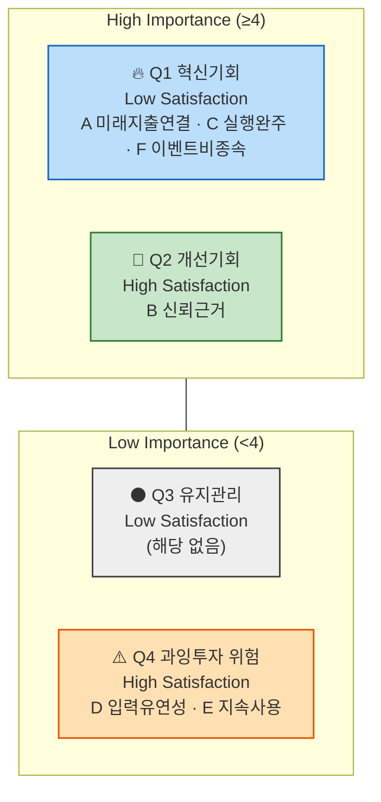

# AOS 분석 결과 — 미래지출 결제설계 서비스

> `가람/0819/시장기회 분석 방법론(AOS).md`의 절차를 실제로 실행한 결과입니다. 원래 별도 문서였던 Pain Point–Goal 매트릭스(입력 자료)를 실제 작업 순서대로 이 문서 맨 앞에 통합했습니다 — **0. Pain Point–Goal 매트릭스(입력) → 1. 후보 확정 → 2. Importance → 3. Satisfaction → 4. AOS 계산 → 5. Matrix 배치 → 6. 결론** 순서로 읽으면 됩니다.
>
> **공식**: `AOS = Importance × (1 − Satisfaction/5)` · **사분면 기준점**: Importance·Satisfaction 각각 **중앙값(median)** 사용(요청 반영)

---

## 0. Pain Point–Goal 매트릭스 (입력 자료)

`가람/0819/고객 여정지도.md` 1~14절 각 인물의 CJM 표에서 "없음"을 제외하고 뽑은 12명 대표 Pain Point(각 3개씩)에, **페르소나 전체 Goal** 열과 **Pain Point별 개별 Goal 추론**을 더한 자료입니다. 각 Pain Point 뒤의 "→ *Goal:*"은 그 Pain을 해소했을 때 충족되는 개별 목표를 추론한 것입니다. 1절부터는 이 중 **Core+Adjacent 8명**(24건)만 1차 채점 대상으로 씁니다.

### Core

| 인물 | 페르소나 Goal | Pain Point 1 | Pain Point 2 | Pain Point 3 |
| --- | --- | --- | --- | --- |
| 이서연 | 결혼 준비 지출을 카드별로 배분해 놓치는 혜택 없이 최대 혜택을 받는 것 | 다가올 지출 규모를 카드 혜택과 연결해 계산할 방법이 없음 → *Goal: 미래 지출을 카드 혜택과 미리 연결해 계산받고 싶다* | 기존 카드추천 앱은 전부 과거 소비 기준이라 신뢰가 안 감 → *Goal: 과거가 아니라 미래 기준으로 계산해주는 서비스를 신뢰하고 싶다* | 해지 단계에서 상담사 만류를 만나면 실행이 막힘 → *Goal: 계산 결과를 실제 해지·전환까지 안전하게 완수하고 싶다* |
| 김도윤 | 결혼+이사 지출을 하나의 결제 계획으로 통합해 실행 순서까지 정하는 것 | 두 이벤트 지출이 동시에 몰릴 때 통합해서 볼 방법이 없음 → *Goal: 여러 이벤트 지출을 하나의 화면에서 한 번에 파악하고 싶다* | 두 이벤트 지출을 따로 입력해야 해서 "통합"이 입력자 몫으로 남음 → *Goal: 입력 부담 없이 서비스가 자동으로 통합해주길 원한다* | 두 이벤트가 끝나면 핵심 가치를 다시 쓸 계기가 줄어듦 → *Goal: 이벤트가 끝난 뒤에도 계속 쓸 이유를 갖고 싶다* |
| 박서준 | 카드사의 일방적 자동대체에 끌려가지 않고 스스로 검증한 근거로 카드를 정하는 것 | 자동대체 전에 미리 확인할 방법이 없음 → *Goal: 카드사 결정 이전에 스스로 먼저 확인하고 대응하고 싶다* | 카드사 설명과 실제 혜택이 달라 혼란 → *Goal: 신뢰할 수 있는 근거로 검증하고 싶다* | 콜센터를 다시 거쳐야 해서 불편 반복 위험 → *Goal: 반복되는 확인 절차 없이 한 번에 안심하고 싶다* |
| 한지민 | 이사 기간 한정 지출에 맞춰 카드 조합을 임시로 바꿨다가 끝나면 원래대로 되돌리는 것 | 소득 불규칙으로 실적구간 예측 불가 → *Goal: 불확실한 소득 상황에서도 안전한 카드 전략을 세우고 싶다* | 단일 숫자 입력 강요 시 이탈 위험 → *Goal: 상황에 맞는 유연한(범위) 입력 방식을 원한다* | 조합을 되돌리는 과정의 번거로움 → *Goal: 이사 기간이 끝나면 힘들이지 않고 원상복구하고 싶다* |
| 최유리 | 회계 업무 경험을 살려 스스로 검증할 수 있는 계산 결과를 받는 것 | 발령처럼 갑작스러운 이벤트는 준비 시간이 짧음 → *Goal: 짧은 시간 안에 빠르게 대응 방안을 받고 싶다* | 근거 부실하면 신뢰를 잃고 엑셀로 회귀 → *Goal: 스스로 검증 가능한 투명한 계산 근거를 원한다* | 다음 변화에도 빠르게 대응해줄지 확신 없음 → *Goal: 반복적으로 발생하는 변화에도 지속적으로 신뢰하고 쓰고 싶다* |

### Adjacent

| 인물 | 페르소나 Goal | Pain Point 1 | Pain Point 2 | Pain Point 3 |
| --- | --- | --- | --- | --- |
| 정하늘 | 이미 하고 있는 수작업 최적화를 자동 계산으로 대체해 시간을 아끼는 것 | 수작업을 대체할 도구가 없음 → *Goal: 이미 하는 최적화를 자동화해 시간을 아끼고 싶다* | 카드 개수가 많을수록 입력 부담 커짐 → *Goal: 카드 수가 많아도 효율적으로 관리하고 싶다* | 자동 갱신이 정책변경을 못 따라가면 신뢰 붕괴 → *Goal: 최신 정책을 항상 반영한 결과를 신뢰하고 싶다* |
| 오세훈 | 혼인·이사 같은 정해진 이벤트가 아니어도, 스스로 입력한 소비 변화만으로 카드 조합을 재설계받는 것 | 이벤트명이 없어 이해받을지 확신 없음 → *Goal: 특정 이벤트가 아니어도 내 상황이 인정받길 원한다* | 마케팅이 혼인·이사 위주라 대상이 아닌 것처럼 보임 → *Goal: 나 같은 케이스도 서비스 대상임을 확인받고 싶다* | 이벤트 선택 강요 시 이탈 → *Goal: 이벤트 없이도 자유롭게 소비 변화를 입력하고 싶다* |
| 강민재 | 지출이 줄어드는 방향의 변화도 반영해 불필요해진 카드를 정리하고 싶은 것 | 지출 감소 케이스는 기존 서비스가 안 맞음 → *Goal: 지출이 줄어드는 상황도 지원받고 싶다* | 신규 앱 학습 의지 낮음 → *Goal: 배우는 노력 없이 바로 이해되는 서비스를 원한다* | 지출 증가만 입력 가능하면 이탈 → *Goal: 지출 감소도 정상적으로 입력하고 정리 제안을 받고 싶다* |

### Extreme (대조군 — 1차 채점 대상 아님)

| 인물 | 페르소나 Goal | Pain Point 1 | Pain Point 2 | Pain Point 3 |
| --- | --- | --- | --- | --- |
| 신은서 | 계산 결과뿐 아니라 실행(해지) 자체를 끝까지 완수하는 것 | 변경 시점을 스스로 알아채기 어려움 → *Goal: 카드 조건 변화를 미리 알림받고 싶다* | 계산은 되지만 실행에서 상담사 만류에 부딪힘 → *Goal: 실행 과정에서 예상되는 장애물에 미리 대비하고 싶다* | 실행의 사회적 마찰까지는 해결 못 함 → *Goal: 계산뿐 아니라 실행까지 끝까지 완주하고 싶다* |
| 윤태호 | 손대지 않고 방치한 카드들까지 포함해 전체를 한 번에 정리·재배치하는 것 | 카드 수가 너무 많아 손대기 부담 → *Goal: 방대한 카드도 부담 없이 한 번에 정리하고 싶다* | 결과를 받고도 실행 못 넘어감(정보 과부하) → *Goal: 실행 가능한 단위로 나눠서 받고 싶다* | 정리 양을 쪼개주지 않으면 계속 이탈 → *Goal: 단계적으로 조금씩 처리해 부담을 줄이고 싶다* |

### Non-user (대조군 — 1차 채점 대상 아님)

| 인물 | 페르소나 Goal | Pain Point 1 | Pain Point 2 | Pain Point 3 |
| --- | --- | --- | --- | --- |
| 조민아 | 미래를 예측하기보다 그때그때 상황에 맞게 대응하는 것으로 충분하다고 느낌 | 미래 지출 예측 전제에 공감 못함 → *Goal: 예측 없이도 그때그때 대응으로 충분하다고 느끼고 싶다* | 온보딩에서 미래 지출 입력 요구 시 이탈 → *Goal: 입력 부담 없이 서비스를 체험하고 싶다* | 예측에 대한 근본적 불신 해소 안 됨 → *Goal: 신뢰할 근거 없이도 안심하고 쓰고 싶다(모순적 니즈)* |
| 배정호 | 복잡한 앱 조작 없이 지금 쓰는 방식 그대로 큰 불편 없이 지내는 것 | 카드 최적화 문제 자체를 못 느낌 → *Goal: 지금 방식(현금·체크카드)을 그대로 유지하고 싶다* | 입력 항목 많은 화면에 거부감 → *Goal: 복잡한 절차 없이 결과만 받고 싶다* | 디지털 채널 자체 거부 → *Goal: 앱을 배우지 않고도 도움을 받고 싶다* |

**Pain Point–Goal 해설**: Core·Adjacent 8명의 Goal은 대부분 **"특정 상황에 맞춰 계산을 자동화하고, 그 결과를 신뢰할 수 있는 근거로 검증하고 싶다"**는 두 축(자동화·신뢰검증)으로 수렴합니다. Extreme 2명(신은서·윤태호)의 Goal은 "실행 완주"에 있지만 원인이 다릅니다(외부 마찰 vs 내부 과부하). Non-user 2명(조민아·배정호)의 Goal은 서비스가 제공하려는 가치와 정면으로 배치되어, Pain Point를 해소해 전환시키는 대상이 아니라 **"서비스가 도달할 수 없는 경계"를 표시하는 참고 자료**로 다룹니다 — 그래서 1절부터는 Extreme·Non-user를 채점 대상에서 제외합니다.

---

## 1. 후보 확정 (AOS 방법론 1단계 — 후보 리스트업)

Core+Adjacent 8명 × Pain Point 3개 = 24건을 같은 Job(진짜 겪는 문제)끼리 묶어 **6개 후보**로 압축했습니다(방법론.md 06 산출물 기준 5~10개 범위 충족).

| # | 후보(통합 Job) | 병합한 출처 Pain Point |
| --- | --- | --- |
| A | 미래/변화하는 지출 상황(이벤트든 아니든)을 카드 혜택과 연결해 자동으로 계산받고 싶다 | 이서연①, 김도윤①, 한지민①, 최유리①, 정하늘① |
| B | 계산 결과를 신뢰할 수 있는 근거로 검증하고 싶다 | 이서연②, 박서준②, 최유리②, 정하늘③ |
| C | 계산 결과를 실제 실행(해지·전환)까지 완주하고 싶다 | 이서연③, 박서준①, 박서준③ |
| D | 입력 부담을 낮추고 유연하게 입력하고 싶다 | 김도윤②, 한지민②, 정하늘②, 강민재② |
| E | 이벤트가 끝나거나 상황이 바뀐 뒤에도 지속적으로 쓸 이유를 갖고 싶다 | 김도윤③, 한지민③, 최유리③ |
| F | 특정 이벤트가 아니어도, 지출 증가든 감소든 내 상황이 서비스 대상으로 인정받고 싶다 | 오세훈①②③, 강민재①③ |

---

## 2. Importance Table (AOS 방법론 2단계)

| # | 후보 | Importance (1~5) | 근거 |
| --- | --- | --- | --- |
| A | 미래 지출-카드 혜택 자동 연결 | **5** | Core+Adjacent 8명 중 5명이 겪는 가장 반복적인 Pain — 서비스의 핵심 존재 이유(F-01~F-03) |
| B | 신뢰 가능한 계산 근거 | **4** | 4명이 겪음. 금전이 걸린 결정이라 신뢰 없이는 실행 자체가 불가능(F-06 직결) |
| C | 실행(해지·전환) 완주 | **4** | 문제③ 🔵(금감원 민원 88.4%↑)로 뒷받침되는 실제 사업 리스크 |
| D | 입력 부담·유연성 | **3** | 4명이 겪지만, 핵심 가치가 아니라 마찰(Friction) 성격 |
| E | 지속 사용 동기 | **3** | 3명(주로 Core)이 겪는 리텐션 이슈 — 단기 매출보다 장기 지표 |
| F | 이벤트 비종속·양방향 지원 | **4** | SAM Phase 2 확장 전략과 직결, Adjacent 전원(오세훈·강민재)이 겪음 |

---

## 3. Satisfaction Table (AOS 방법론 3단계 — 현재 대안의 충족 수준)

| # | 후보 | 현재 대안 | Satisfaction (1~5) | 근거 |
| --- | --- | --- | --- | --- |
| A | 미래 지출-카드 혜택 자동 연결 | 뱅크샐러드·카드고릴라(과거 소비 기준), 엑셀, 지인 추천 | **1** | 경쟁사 6곳 중 미래소비반영 조건 충족 0곳(0818 브리프 2절) |
| B | 신뢰 가능한 계산 근거 | 뱅크샐러드(근거공개 ◐), 카드사 콜센터 설명 | **2** | 부분 공개 수준, 카드사 설명은 오히려 불신 유발(박서준 사례) |
| C | 실행(해지·전환) 완주 | 카드사 콜센터 직접 해지 | **1** | 상담사 만류·전환유도가 실행을 적극적으로 막음(문제③) |
| D | 입력 부담·유연성 | 엑셀 수기 관리, 스펙 비교 후 감으로 결정 | **2** | 수작업 자체가 부담의 원인이라 만족도 낮음 |
| E | 지속 사용 동기 | 특별한 대안 없음(이벤트 종료 후 방치) | **2** | 리텐션을 위한 대안 자체가 시장에 없음 |
| F | 이벤트 비종속·양방향 지원 | 없음(경쟁사 전원 이벤트 특정/증가 방향 가정) | **1** | 교차도메인 2×2 매트릭스에서 "미래입력+최적화" 칸이 전 산업에서 빈칸(효진 리서치) |

---

## 4. AOS Table (AOS 방법론 4단계)

`AOS = Importance × (1 − Satisfaction/5)`

| # | 후보 | Importance | Satisfaction | 1−Sat/5 | **AOS** | 순위 |
| --- | --- | --- | --- | --- | --- | --- |
| A | 미래 지출-카드 혜택 자동 연결 | 5 | 1 | 0.8 | **4.0** | 1 |
| C | 실행(해지·전환) 완주 | 4 | 1 | 0.8 | **3.2** | 2 (공동) |
| F | 이벤트 비종속·양방향 지원 | 4 | 1 | 0.8 | **3.2** | 2 (공동) |
| B | 신뢰 가능한 계산 근거 | 4 | 2 | 0.6 | **2.4** | 4 |
| D | 입력 부담·유연성 | 3 | 2 | 0.6 | **1.8** | 5 (공동) |
| E | 지속 사용 동기 | 3 | 2 | 0.6 | **1.8** | 5 (공동) |

---

## 5. Matrix 배치 (AOS 방법론 5단계 — 중앙값 기준 사분면)

**중앙값 계산**: Importance {5,4,4,3,3,4} → 정렬 3,3,4,4,4,5 → **median = 4.0** / Satisfaction {1,2,1,2,2,1} → 정렬 1,1,1,2,2,2 → **median = 1.5**

| # | 후보 | Importance | Satisfaction | 판정(중앙값 대비) | 사분면 |
| --- | --- | --- | --- | --- | --- |
| A | 미래 지출-카드 혜택 자동 연결 | 5 (≥4) | 1 (<1.5) | High Imp · Low Sat | **Q1 혁신기회** |
| C | 실행 완주 | 4 (≥4) | 1 (<1.5) | High Imp · Low Sat | **Q1 혁신기회** |
| F | 이벤트 비종속·양방향 지원 | 4 (≥4) | 1 (<1.5) | High Imp · Low Sat | **Q1 혁신기회** |
| B | 신뢰 가능한 계산 근거 | 4 (≥4) | 2 (≥1.5) | High Imp · High Sat | **Q2 개선기회** |
| D | 입력 부담·유연성 | 3 (<4) | 2 (≥1.5) | Low Imp · High Sat | **Q4 과잉투자 위험** |
| E | 지속 사용 동기 | 3 (<4) | 2 (≥1.5) | Low Imp · High Sat | **Q4 과잉투자 위험** |



> `quadrantChart` 문법이 GitHub에서 렌더링되지 않아, 이미 검증된 `flowchart` 서브그래프 방식(`가람/0819/시장기회 분석 방법론(AOS).md` 1절과 동일 스타일)으로 교체했습니다. 4·5절의 표가 동일한 정보를 담은 대체 형태이기도 합니다.

---

## 6. 결론 — 우선순위 (AOS 내림차순)

1. **A. 미래 지출-카드 혜택 자동 연결** (AOS 4.0, Q1) — MVP 핵심 기능(F-01~F-03)의 존재 근거. **JTBD 인터뷰 1순위 대상**
2. **C. 실행 완주** (AOS 3.2, Q1) — 해지·전환 실행 마찰이 서비스 매력도에 미치는 영향을 보여주는 핵심 기회(단, 해지 실행 지원 자체는 마이데이터 기반 서비스 권한 밖). 신은서 유형이 이 후보의 실사용자 대리 지표
3. **F. 이벤트 비종속·양방향 지원** (AOS 3.2, Q1) — SAM Phase 2 확장 전략의 시장기회 근거. 오세훈·강민재가 대리 지표
4. **B. 신뢰 가능한 계산 근거** (AOS 2.4, Q2) — 이미 F-06으로 대응 중, 지속 개선 영역
5. **D. 입력 부담·유연성 / E. 지속 사용 동기** (AOS 1.8, Q4) — 지금 단계에서는 우선순위 낮음, 자원 배분 재검토 대상

⚠️ **한계**: Importance·Satisfaction 점수는 실측 설문이 아니라 Evidence Log(E-01~E-07)와 CJM 감정 곡선을 근거로 한 팀 추정(🟡)입니다. B·C·F가 정확히 동점(AOS 3.2, Importance 4 공동)이라는 점, 표본이 6개뿐이라 중앙값이 불안정하다는 점도 07 JTBD 인터뷰로 검증이 필요합니다.

---

**연결 문서**: `가람/0819/시장기회 분석 방법론(AOS).md` · `가람/0819/Evidence Log.md` · `가람/0819/고객 여정지도.md` · `가람/0819/JTBD 분석 방법론.md` · `가람/0819/DOS 분석 방법론.md` · `가람/0819/페르소나 스펙트럼 분석 보고서.md`(페르소나 Goal 원본)

---

# DOS 분석 결과 — 미래지출 결제설계 서비스

> `가람/0819/DOS 분석 방법론.md`(정정판)의 Output Format대로 채점한 결과입니다. **8명·6개 후보(A~F) 전체**를 대상으로, Market Relevance 모수를 `가람/0819/DOS Market Relevance 모수 판단.md`가 페르소나별로 준 권장 범위의 **상단값(SOM 버전)**과 **하단값(SAM 버전)** 두 가지로 각각 적용해 산출했습니다.
>
> **공식**: `DOS = (Importance − Satisfaction) × Market Relevance`

---

## 0. 전체 범위 — 8명·6후보 통합 DOS 순위표 (SOM/SAM 버전)

Importance·Satisfaction은 `가람/0819/AOS 분석 결과.md` 2·3절 값을 그대로 가져왔습니다. 후보 하나에 여러 페르소나가 걸쳐 있으면(예: 후보 A = 이서연+김도윤+한지민+최유리+정하늘) 각 페르소나의 값을 평균해 그 후보의 Market Relevance로 삼았습니다.

### SOM 버전 (페르소나별 권장 범위의 상단값 — 현재 채택 중인 좁은 시장에서의 도달가능성을 낙관적으로 가정)

| 페르소나 | Market Rel(SOM) |
| --- | --- |
| 이서연·박서준 | 1.0 |
| 김도윤 | 0.9 |
| 한지민·최유리 | 0.7 |
| 정하늘·오세훈·강민재 | 0.5 |

| Pain/Goal(후보) | 기여 페르소나 | Imp | Sat | Market Rel | DOS | Insight |
| --- | --- | --- | --- | --- | --- | --- |
| A. 미래지출-카드혜택 자동 연결 | 이서연·김도윤·한지민·최유리·정하늘 | 5 | 1 | **0.76** | **3.04** | 8명 중 5명이 겪는 가장 넓은 문제 — SOM 낙관 가정에서는 전체 6후보 중 1위 |
| C. 실행(해지·전환) 완주 | 이서연·박서준 | 4 | 1 | **1.00** | **3.00** | 기여자 전원이 SOM 상단값(1.0)이라 MR이 최고치 — A와 근소한 차이로 2위 |
| B. 신뢰 가능한 계산 근거 | 이서연·박서준·최유리·정하늘 | 4 | 2 | **0.80** | **1.60** | 3위, F보다 근소하게 앞섬 |
| F. 이벤트 비종속·양방향 지원 | 오세훈·강민재 | 4 | 1 | **0.50** | **1.50** | AOS에서는 A·C와 동급(혁신기회)이었지만 SOM 버전에서도 4위로 밀림 |
| E. 지속 사용 동기 | 김도윤·한지민·최유리 | 3 | 2 | **0.77** | **0.77** | 5위 |
| D. 입력 부담·유연성 | 김도윤·한지민·정하늘·강민재 | 3 | 2 | **0.65** | **0.65** | 6위(최하위) |

**SOM 버전 순위**: A(3.04) > C(3.00) > B(1.60) > F(1.50) > E(0.77) > D(0.65)

### 혼합 매트릭스 (SOM 버전, median AOS 2.8·DOS 1.55)


---

### SAM 버전 (페르소나별 권장 범위의 하단값 — Phase 1로 확장했을 때의 보수적 도달가능성)

| 페르소나 | Market Rel(SAM) |
| --- | --- |
| 이서연·박서준 | 0.8 |
| 김도윤 | 0.7 |
| 한지민·최유리 | 0.5 |
| 정하늘 | 0.4 |
| 오세훈·강민재 | 0.3 |

| Pain/Goal(후보) | 기여 페르소나 | Imp | Sat | Market Rel | DOS | Insight |
| --- | --- | --- | --- | --- | --- | --- |
| C. 실행(해지·전환) 완주 | 이서연·박서준 | 4 | 1 | **0.80** | **2.40** | 기여자 전원이 SOM 계열(0.8)이라 MR 손실이 가장 적어 — SAM 버전에서는 **A를 제치고 1위** |
| A. 미래지출-카드혜택 자동 연결 | 이서연·김도윤·한지민·최유리·정하늘 | 5 | 1 | **0.58** | **2.32** | 기여자가 SAM Phase2까지 걸쳐 있어 하단값 평균이 C보다 낮음 — 2위로 밀림 |
| B. 신뢰 가능한 계산 근거 | 이서연·박서준·최유리·정하늘 | 4 | 2 | **0.63** | **1.26** | 3위 |
| F. 이벤트 비종속·양방향 지원 | 오세훈·강민재 | 4 | 1 | **0.30** | **0.90** | SAM 하단값(0.3)이 가장 낮은 계층이라 SOM 버전보다 순위 격차가 더 벌어짐 — 4위 |
| E. 지속 사용 동기 | 김도윤·한지민·최유리 | 3 | 2 | **0.57** | **0.57** | 5위 |
| D. 입력 부담·유연성 | 김도윤·한지민·정하늘·강민재 | 3 | 2 | **0.48** | **0.48** | 6위(최하위) |

**SAM 버전 순위**: C(2.40) > A(2.32) > B(1.26) > F(0.90) > E(0.57) > D(0.48)

### 혼합 매트릭스 (SAM 버전, median AOS 2.8·DOS 1.08)


---

## 핵심 발견

- **A와 C의 순위가 모수 선택에 따라 뒤바뀝니다** — SOM 버전(낙관적 도달가능성)에서는 A(3.04)가 근소하게 1위지만, SAM 버전(보수적 도달가능성)에서는 C(2.40)가 A(2.32)를 근소하게 앞섭니다. 두 값이 항상 근접해 있다는 것 자체가 "A와 C는 사실상 공동 1위"라는 결론을 어떤 모수를 쓰든 지지합니다.
- **F는 두 버전 모두에서 4위**입니다 — AOS 단독으로는 A·C와 동급(혁신기회 Q1)이었지만, SOM/SAM 어느 시나리오로 Market Relevance를 매겨도 시장 가중 후에는 순위가 크게 밀립니다. **`가람/0819/JTBD 분석 방법론.md` 1-2-1절의 3순위(F)를 이 결과로 보아 낮춰야 할지는 팀 논의가 필요합니다.**
- **B는 두 버전 모두에서 3위**, **D·E는 두 버전 모두에서 5·6위**로 순위 자체는 모수 선택과 무관하게 안정적입니다 — 순위가 흔들리는 지점은 A·C뿐입니다.

---

**연결 문서**: `가람/0819/DOS 분석 방법론.md` · `가람/0819/DOS Market Relevance 모수 판단.md` · `가람/0819/AOS 분석 결과.md`(2·3절 Importance·Satisfaction 원본) · `가람/0819/AOS-DOS 혼합 매트릭스.md`

---

# DOS Market Relevance 모수 판단 — 미래지출 결제설계 서비스

> `가람/0819/AOS 분석 결과.md` 0절의 36개 Pain Point(12명 × 3개)에 DOS(`가람/0819/DOS 분석 방법론.md`)의 Market Relevance(0.1~1.0)를 매길 때, **어떤 TAM-SAM-SOM 모수를 기준으로 삼을지** 재판단한 문서입니다. 기존 문서(AOS 분석 결과·DOS 분석 방법론·CJM 등)는 수정하지 않고, 이 문서에서 판단만 남깁니다. 근거는 `윤정/0819_04_TAM-SAM-SOM 마켓세그먼트.md`(TAM 앵커 확정본, "재논의 금지")를 그대로 따릅니다.
>
> **재판단 배경**: 1차본은 "SOM에 가까울수록 높게, TAM에 가까울수록 낮게"라는 직관적 기준만 썼습니다. 다시 짚어보니 이 직관 뒤에 숨은 진짜 문제가 있었습니다 — **SOM은 원래 TAM보다 인원수가 훨씬 작은 계층인데(SOM ⊂ SAM ⊂ TAM), 만약 Market Relevance를 "TAM 전체 대비 순수 인원 비중(%)"으로만 계산하면 오히려 SOM(이서연 등)이 가장 낮은 점수를 받게 됩니다.** 이는 우리 팀이 이미 확정한 우선순위(Q1 혼인=1차 표적)와 정반대 결론이 됩니다. 그래서 이번 판단은 "인원 비중(%)"과 "도달가능성"을 곱한 2요인 모델로 다시 구성합니다.

---

## 1. 결론 — "인원 비중 × 도달가능성" 2요인 모델

`가람/0819/DOS 분석 방법론.md` Rules 2번은 Market Relevance를 "TAM-SAM-SOM(%)... 을 사용하거나, 시장 성장률, **채택난이도**, **확산성** 등을 추가로 고려해 평가"하라고 이미 허용하고 있습니다. 순수 인원 비중만으로는 위에서 지적한 역전 문제가 생기므로, 이 조항을 근거로 두 요인을 곱합니다.

```
Market Relevance ≈ normalize( 인원 비중(그 계층 / TAM) × 도달가능성 가중치 )
```

- **인원 비중**: 그 페르소나가 속한 계층(SOM/SAM Phase1/SAM Phase2/TAM)이 TAM 전체에서 차지하는 대략적 크기
- **도달가능성 가중치**: 지금 이 시점에 실제로 채널·제품이 그 계층에 닿을 수 있는 정도 — SOM(현재 채택 중인 Beachhead)이 가장 높고, 채널 전략이 아직 없는 계층일수록 낮음

이렇게 하면 **SOM은 인원 비중은 작아도 도달가능성이 압도적으로 높아 최종 점수가 가장 높게 나오고**, TAM 전체를 겨냥한 막연한 Pain은 인원 비중은 커도 도달가능성이 낮아 점수가 낮게 나옵니다 — 우리 팀의 실제 Segment Map 우선순위(Q1 > Q2 > Q3·Q4 대상 아님)와 정합됩니다.

---

## 2. 12명 → 계층·비중·도달가능성 매핑

| 페르소나 | 유형 | 해당 계층 | 인원 비중(TAM 대비, 개략) | 도달가능성 가중치 | 최종 권장 Market Relevance |
| --- | --- | --- | --- | --- | --- |
| 이서연 | Core | **SOM** | 최소(혼인 연 48만 명의 하위 부분집합 — 🟡 미확정) | **최고** — 현재 실제로 겨냥 중인 Beachhead, 채널 지표(카드고릴라 140만·뱅크샐러드 130만) 존재 | **0.8~1.0** |
| 박서준 | Core | **SOM** | 최소(위와 동일) | 최고 | **0.8~1.0** |
| 김도윤 | Core | **SOM**(Q1 성분 기준) | 최소(혼인+이사 중복 부분집합) | 높음(Q1 요소가 주력) | **0.7~0.9** |
| 한지민 | Core | **SAM Phase 1**(Q2) | 소(이사 대리지표 — 🟠 실수치 미확인) | 중간 — 2차 표적으로 순위는 있으나 채널 미확정 | **0.5~0.7** |
| 최유리 | Core | **SAM Phase 1**(Q2) | 소(위와 동일) | 중간 | **0.5~0.7** |
| 정하늘 | Adjacent | **SAM Phase 2** | 중(이벤트 비종속 확장 전체 — ⚪ 추정치만 존재) | 중하 — 제품 로직 일반화 후 확장 예정이나 아직 미실행 | **0.4~0.5** |
| 오세훈 | Adjacent | **SAM Phase 2** | 중(위와 동일) | 중하 | **0.3~0.5** |
| 강민재 | Adjacent | **SAM Phase 2** | 중(위와 동일) | 중하 | **0.3~0.5** |
| 신은서 | Extreme | **TAM 전체** | 대(카드 보유자 전체 중 조건변경을 겪는 무작위 하위집합) | 낮음 — 특정 채널·세그먼트 전략 없음(Segment Map Q4와 유사 논리) | **0.2~0.4** |
| 윤태호 | Extreme | **TAM 전체** | 대(카드 다장보유자 — TAM 내 특정 안 된 하위집합) | 낮음 | **0.2~0.3** |
| 조민아 | Non-user | **TAM 경계** | 대(TAM 안에 있으나 전환 실패) | 최저에 가까움 — 온보딩 단계에서 이미 이탈 | **0.1~0.2** |
| 배정호 | Non-user | **TAM 밖** | 해당 없음(TAM 자격 미달 — 마이데이터 미이용) | 0에 가까움 | **0.1** |

각 페르소나의 3개 Pain은 같은 사람이 겪는 문제이므로 계층·비중·가중치를 그대로 상속받습니다(36개 Pain = 이 12행 × 3).

> 인원 비중 열의 "최소/소/중/대"는 실제 KOSIS 수치가 아니라 `04_TAM-SAM-SOM` 문서의 🟠/⚪/🟡 확정 전 상태를 그대로 반영한 상대적 서술입니다. 왜 그럼에도 SOM이 "최소"인데 최종 점수가 가장 높은지가 이번 재판단의 핵심입니다(1절 참고).

---

## 3. 왜 이렇게 나누는가 (2요인 모델 적용 근거)

- **SOM 우선(이서연·박서준·김도윤)**: 인원 비중은 SAM·TAM보다 작지만, `04_TAM-SAM-SOM` 문서가 "Q1 혼인 = 1차 표적(SOM)"으로 이미 확정했고 지출강도(1,473만~2,203만원, 🔵)까지 확보된 유일한 층입니다. 도달가능성이 압도적으로 높아 2요인 곱셈에서 최고 점수가 됩니다.
- **SAM Phase 1(한지민·최유리)**: Q2(이사)는 "2차 표적"으로 순위는 있지만 대리지표 실수치가 🟠 미확인이라 도달가능성을 SOM만큼 높게 줄 수 없습니다. 인원 비중은 SOM보다 크지만 도달가능성 할인으로 중간 점수에 머뭅니다.
- **SAM Phase 2(정하늘·오세훈·강민재)**: 인원 비중은 이 중 가장 클 수 있지만(이벤트 비종속이라 잠재 대상이 넓음), `04_TAM-SAM-SOM` 문서 스스로 "⚪ 추정, 실측 데이터 없음"이라 도달가능성 가중치를 낮게 잡아야 근거 없는 낙관을 피할 수 있습니다.
- **TAM 일반(신은서·윤태호)**: 인원 비중(분모=TAM 전체)만 보면 가장 커 보이지만, 이 Pain을 겨냥한 채널·세그먼트 전략이 없어 도달가능성이 가장 낮습니다. Segment Map Q4("카드 갱신 일반군")가 "대상 아님"으로 판정된 것과 같은 논리 — **크지만 닿을 수 없는 시장은 관련도가 낮다**는 이번 재판단의 핵심 사례입니다.
- **TAM 경계·TAM 밖(조민아·배정호)**: 인원 비중과 무관하게 도달가능성 자체가 구조적으로 막혀 있습니다(온보딩 이탈, 자격 미달). 두 요인 곱셈에서 최저 구간이 되는 것이 자연스럽습니다.

---

## 4. 남는 불확실성 (팀 확인 필요)

- 인원 비중·도달가능성 모두 정성적 판단(🟠/⚪/🟡)입니다. SAM Phase 1·2, TAM 고유인원 실수치가 확정되면(`04_TAM-SAM-SOM` 5·6절) 이 표는 정량 재계산이 필요합니다.
- "도달가능성 가중치"라는 새 개념 자체가 이번 문서에서 처음 도입한 것이라, 팀이 이 2요인 모델 자체에 동의하는지 확인이 필요합니다 — 동의하지 않으면 `가람/0819/DOS 분석 방법론.md` Rules 2번의 "채택난이도·확산성" 조항 해석을 다시 논의해야 합니다.
- 김도윤(혼인+이사 결합)을 SOM 성분 위주로 볼지, 별도 "복합 세그먼트"로 분리할지는 여전히 팀 논의 대상입니다.
- 신은서·윤태호의 Market Relevance가 낮다고 해서 Importance까지 낮은 건 아닙니다(F-05 스코프 결정에 이미 반영된 문제③) — DOS 결과 해석 시 이 점을 함께 언급해야 합니다.

---

**연결 문서**: `윤정/0819_04_TAM-SAM-SOM 마켓세그먼트.md`(TAM-SAM-SOM 확정본, 재논의 금지) · `가람/0819/AOS 분석 결과.md`(0절 Pain Point–Goal 매트릭스) · `가람/0819/DOS 분석 방법론.md`(0절 AOS→DOS 개념, Rules 2번)

---

# AOS–DOS 혼합 매트릭스 — 미래지출 결제설계 서비스

> `가람/0819/AOS 분석 결과.md`의 AOS 점수(X축)와 `가람/0819/DOS 분석 결과.md`의 DOS 점수(Y축)를 6개 후보(A~F) 전체 단위로 대조한 혼합 매트릭스입니다. DOS는 Market Relevance 모수를 페르소나별 권장 범위의 **상단값(SOM 버전)**과 **하단값(SAM 버전)**으로 각각 적용한 두 버전을 담았습니다.
>
> 사분면 경계선은 각 버전의 AOS·DOS **중앙값**을 기준으로 그었습니다.

---

## 원본 점수

| 후보 | Pain/Goal | AOS | DOS(SOM 버전) | DOS(SAM 버전) |
| --- | --- | --- | --- | --- |
| A | 미래지출-카드혜택 자동 연결 | 4.0 | 3.04 | 2.32 |
| C | 실행(해지·전환) 완주 | 3.2 | 3.00 | 2.40 |
| B | 신뢰 가능한 계산 근거 | 2.4 | 1.60 | 1.26 |
| F | 이벤트 비종속·양방향 지원 | 3.2 | 1.50 | 0.90 |
| E | 지속 사용 동기 | 1.8 | 0.77 | 0.57 |
| D | 입력 부담·유연성 | 1.8 | 0.65 | 0.48 |

---

## SOM 버전 (median AOS 2.8, DOS 1.55)


| 후보 | AOS | DOS | 판정(중앙값 대비) | 사분면 |
| --- | --- | --- | --- | --- |
| A | 4.0 (≥2.8) | 3.04 (≥1.55) | High AOS · High DOS | **최우선** |
| C | 3.2 (≥2.8) | 3.00 (≥1.55) | High AOS · High DOS | **최우선** |
| B | 2.4 (<2.8) | 1.60 (≥1.55) | Low AOS · High DOS | **시장주도** |
| F | 3.2 (≥2.8) | 1.50 (<1.55) | High AOS · Low DOS | **니치** |
| E | 1.8 (<2.8) | 0.77 (<1.55) | Low AOS · Low DOS | **후순위** |
| D | 1.8 (<2.8) | 0.65 (<1.55) | Low AOS · Low DOS | **후순위** |

---

## SAM 버전 (median AOS 2.8, DOS 1.08)


| 후보 | AOS | DOS | 판정(중앙값 대비) | 사분면 |
| --- | --- | --- | --- | --- |
| A | 4.0 (≥2.8) | 2.32 (≥1.08) | High AOS · High DOS | **최우선** |
| C | 3.2 (≥2.8) | 2.40 (≥1.08) | High AOS · High DOS | **최우선** |
| B | 2.4 (<2.8) | 1.26 (≥1.08) | Low AOS · High DOS | **시장주도** |
| F | 3.2 (≥2.8) | 0.90 (<1.08) | High AOS · Low DOS | **니치** |
| E | 1.8 (<2.8) | 0.57 (<1.08) | Low AOS · Low DOS | **후순위** |
| D | 1.8 (<2.8) | 0.48 (<1.08) | Low AOS · Low DOS | **후순위** |

---

## 해석

- **사분면 배치는 SOM·SAM 두 버전 모두 동일합니다** — A·C 최우선, B 시장주도, F 니치, D·E 후순위. Market Relevance 모수를 낙관적(SOM)으로 잡든 보수적(SAM)으로 잡든 "무엇을 먼저 실행해야 하는가"라는 결론 자체는 흔들리지 않는다는 뜻입니다.
- **A·C의 순위(어느 쪽이 근소하게 앞서는가)만 모수에 따라 달라집니다** — SOM 버전은 A(3.04)가, SAM 버전은 C(2.40)가 근소하게 앞섭니다. 둘 다 최우선 사분면 안에 있다는 사실은 변하지 않습니다.
- **F(이벤트 비종속·양방향 지원)**: AOS 단독으로는 A·C와 동급(Q1 혁신기회)이었지만, SOM·SAM 어느 버전에서도 **니치**(우하단)로 이동 — 고객 임팩트는 크지만 SAM Phase 2 특유의 낮은 도달가능성 때문에 시장 가중 후에는 후순위로 밀립니다. `가람/0819/JTBD 분석 방법론.md` 1-2-1절의 F 우선순위 조정 필요성을 두 버전 모두에서 뒷받침합니다.
- **D·E**: 두 버전 모두 **후순위**(좌하단) — 모수 선택과 무관하게 우선순위가 낮습니다.

---

**연결 문서**: `가람/0819/AOS 분석 결과.md` · `가람/0819/DOS 분석 결과.md` · `가람/0819/DOS Market Relevance 모수 판단.md` · `가람/0819/JTBD 분석 방법론.md`(1-2-1절)
