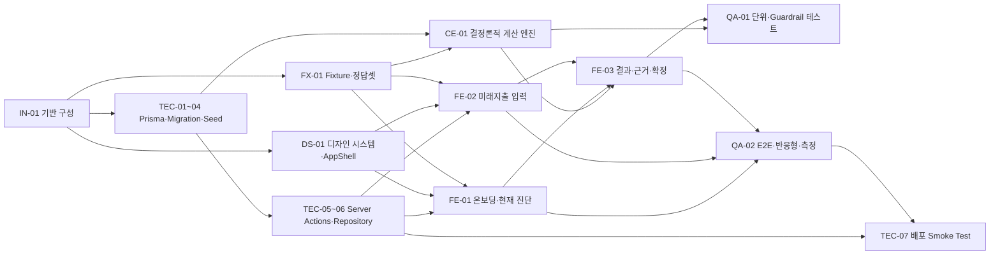
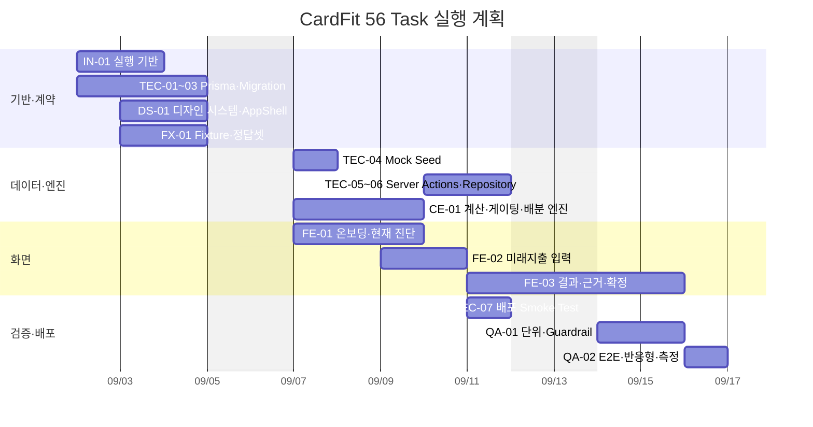

# CardFit Task 의존성 및 Gantt 계획

> 기준본: `docs/tasks/TASK_LIST.md` 56건 · 시작일: 2026-09-02 · 개발자: 3명

## 계획 가정

- Task당 기본 소요시간은 0.5일이다.
- 평일만 작업하며 주말은 버퍼로 둔다.
- 한 개발자는 같은 반일 슬롯에 하나의 Task만 수행한다.
- `TASK_LIST.md`의 선행 Task를 준수한다.
- 실제 구현 중 DB 스키마·규칙 변경이 발생하면 후행 일정은 다시 산정한다.

## 의존성 구조

핵심 Critical Path 후보는 다음과 같다.

`IN-01-01 → IN-01-02 → FX-01-01 → FX-01-02 → CE-01-04 → CE-01-05 → CE-01-06 → CE-01-07 → FE-03-03 → FE-03-06 → FE-03-07 → QA-02-03 → QA-02-04`

이는 일정 산정용 대표 경로이며, 실제 Critical Path는 작업 완료 시각과 재작업 여부에 따라 변할 수 있다.

## 개발자 3명 기준 반일 배정

| 날짜 | 오전 — 개발자 1 / 2 / 3 | 오후 — 개발자 1 / 2 / 3 |
|---|---|---|
| 09-02 (수) | `IN-01-01` / `TEC-01` / 대기·문서 확인 | `IN-01-02` / `IN-01-03` / `IN-01-05` |
| 09-03 (목) | `DS-01-01` / `FX-01-01` / `TEC-02` | `DS-01-02` / `FX-01-02` / `FX-01-03` |
| 09-04 (금) | `DS-01-03` / `DS-01-04` / `FX-01-04` | `DS-01-06` / `DS-01-07` / `FX-01-06` |
| 09-07 (월) | `TEC-03` / `CE-01-01` / 대기·계약 확인 | `TEC-04` / `CE-01-02` / `FE-01-01` |
| 09-08 (화) | `CE-01-03` / `CE-01-04` / `FE-01-03` | `CE-01-05` / `CE-01-10` / `FE-01-04` |
| 09-09 (수) | `CE-01-06` / `CE-01-08` / `FE-01-05` | `CE-01-07` / `CE-01-09` / `FE-02-01` |
| 09-10 (목) | `FE-02-02` / `FE-02-05` / `TEC-05` | `FE-02-03` / 대기·통합 확인 / `TEC-06` |
| 09-11 (금) | `FE-02-06` / `FE-03-01` / `TEC-07` | `FE-03-02` / 통합 확인 / 배포 확인 |
| 09-14 (월) | `FE-03-03` / `FE-03-04` / `QA-01-01` | `FE-03-05` / `QA-01-02` / `QA-01-03` |
| 09-15 (화) | `FE-03-06` / 통합 확인 / 회귀 수정 | `FE-03-07` / `QA-01-04` / 회귀 수정 |
| 09-16 (수) | `QA-02-01` / `QA-02-02` / `QA-02-03` | `QA-02-04` / 최종 검토 / 최종 검토 |

## Gantt 차트

## 일정 판단

- 개발 Task 완료 목표는 2026-09-16이다.
- 09-17~09-18은 통합 오류, DB Seed 재적재, Preview 검증을 위한 버퍼로 둔다.
- `TEC-02` Schema와 `CE-01` 계산 입력 계약이 변경되면 가장 많은 후행 Task가 영향을 받으므로 일정상 위험도가 높다.
- `QA-02-04`는 단순 스크린샷 작업이 아니라 추적표·Guardrail·측정 결과를 최종 확인하는 마감 Task이므로 앞당기지 않는다.
- 대기 슬롯은 불필요한 신규 Task를 추가하는 데 쓰지 않고, 코드리뷰·계약 확인·재작업에 사용한다.

## 재산정 규칙

다음 조건이 발생하면 Gantt를 다시 계산한다.

1. Prisma Schema 또는 Server Actions 계약 변경
2. `CE-01-07` 게이팅 규칙 변경
3. Fixture의 12개월 데이터 구조 변경
4. QA에서 근거 누락·금지어·결정론성 오류 발견
5. 개발자 중 1명 이상이 반일 이상 일정에서 이탈
