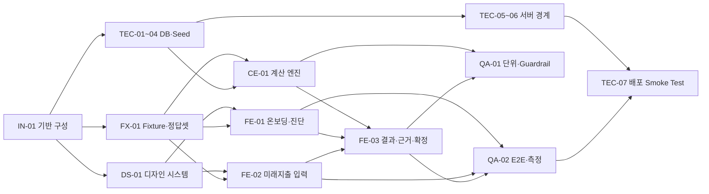
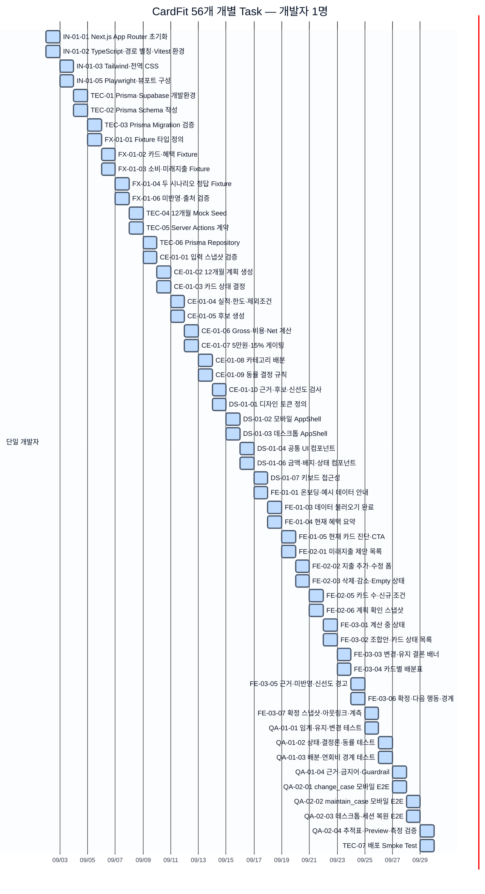

# CardFit Task 의존성 및 Gantt 계획

> 기준본: `docs/tasks/TASK_LIST.md` 56건 · 시작일: 2026-09-02 · 개발자: 1명 · 주말 포함 작업

## 계획 가정

- Task당 기본 소요시간은 0.5일이다.
- 개발자 1명이 한 번에 하나의 Task를 수행한다.
- `TASK_LIST.md`의 선행 Task를 준수한다.
- 56개 반일 슬롯으로 2026-09-29에 개발 Task를 완료하고, 09-30을 통합·재작업 버퍼로 둔다.

## 의존성 구조

## 56개 개별 Task Gantt

각 막대는 `Task ID 작업명`으로 표시한다. 주말도 작업일이므로 회색 주말 제외 영역을 사용하지 않는다.

## 일정 판단

- 개발 Task 완료 목표는 2026-09-29이다.
- `TEC-02 → TEC-05 → TEC-06`, `FX-01 → CE-01`, `CE-01·FE-03 → QA-02`가 주요 순차 구간이다.
- 개발자 1명 기준에서는 병렬화가 불가능하므로 09-30을 통합·재작업 버퍼로 둔다.
- `TEC-07`은 QA-02 완료 후 수행해 배포 전 검증을 마감한다.

## 재산정 규칙

Prisma Schema, Server Actions 계약, 12개월 Fixture, 게이팅 규칙, 테스트 결과 또는 투입 인원이 변경되면 Gantt를 다시 계산한다.
