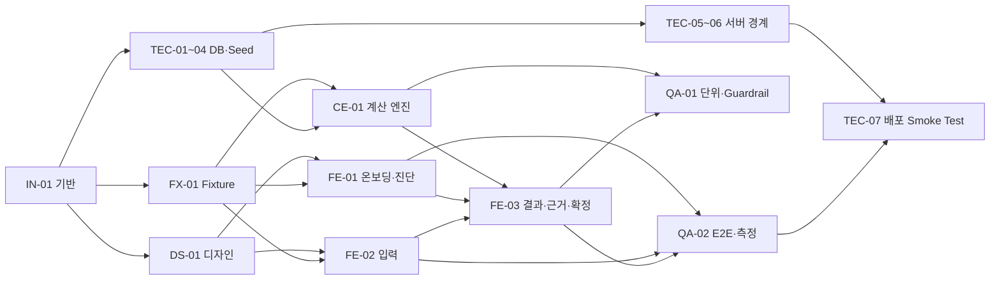
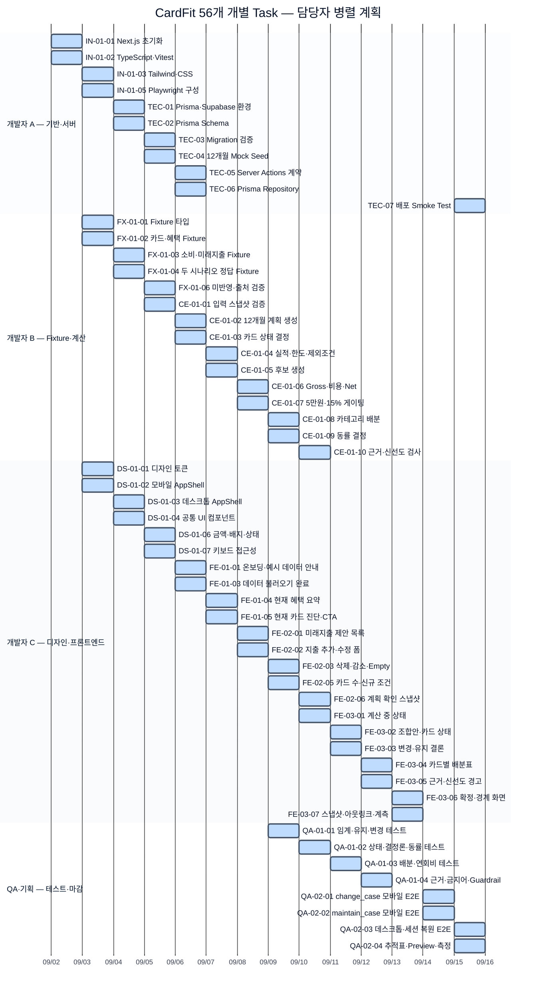

# CardFit Task 의존성 및 Gantt 계획

> 기준본: `docs/tasks/TASK_LIST.md` 56건 · 시작일: 2026-09-02 · 개발자 3명 + QA/기획 1명 · 주말 포함 작업

## 담당자 가정

| 담당자 | 책임 범위 |
|---|---|
| 개발자 A | Next.js 기반·Prisma·Supabase·Server Actions·배포 |
| 개발자 B | Mock Fixture·결정론적 계산 엔진 |
| 개발자 C | 디자인 시스템·프론트엔드 화면 |
| QA/기획 | 단위 테스트·E2E·Guardrail·추적표·측정 |

Task당 기본 소요시간은 0.5일이며, 담당자의 선행 조건이 충족되면 다른 담당자의 작업과 병렬로 시작한다. 2026-09-15까지 개발·검증 완료, 09-16을 통합·재작업 버퍼로 둔다.

## 의존성 구조

## 담당자별 반일 실행계획 — 56개 전체

| 날짜 | 개발자 A — 기반/서버 | 개발자 B — Fixture/계산 | 개발자 C — UI | QA/기획 |
|---|---|---|---|---|
| 09-02 (수) | `IN-01-01` Next.js 초기화 / `IN-01-02` TS·Vitest | 대기·계약 확인 | 대기·디자인 확인 | 계획·AC 검토 |
| 09-03 (목) | `IN-01-03` Tailwind / `IN-01-05` Playwright | `FX-01-01` 타입 정의 / `FX-01-02` 카드·혜택 Fixture | `DS-01-01` 토큰 / `DS-01-02` 모바일 AppShell | 테스트 기준 검토 |
| 09-04 (금) | `TEC-01` DB 환경 / `TEC-02` Prisma Schema | `FX-01-03` 소비 Fixture / `FX-01-04` 정답 Fixture | `DS-01-03` 데스크톱 Shell / `DS-01-04` 공통 UI | Fixture 검토 |
| 09-05 (토) | `TEC-03` Migration / `TEC-04` Mock Seed | `FX-01-06` 미반영·출처 / `CE-01-01` 입력 검증 | `DS-01-06` 금액 컴포넌트 / `DS-01-07` 접근성 | AC-001 검토 |
| 09-06 (일) | `TEC-05` Server Actions / `TEC-06` Repository | `CE-01-02` 계획 생성 / `CE-01-03` 카드 상태 | `FE-01-01` 온보딩·예시 안내 / `FE-01-03` 완료 상태 | 단위 테스트 초안 |
| 09-07 (월) | 통합·계약 확인 | `CE-01-04` 실적·한도 / `CE-01-05` 후보 생성 | `FE-01-04` 혜택 요약 / `FE-01-05` 카드 진단 | AC-002·004 검토 |
| 09-08 (화) | 서버 오류 계약 보완 | `CE-01-06` Gross·Net / `CE-01-07` 게이팅 | `FE-02-01` 제안 목록 / `FE-02-02` 입력 폼 | 계산 경계 검토 |
| 09-09 (수) | 서버 계층 통합 확인 | `CE-01-08` 배분 / `CE-01-09` 동률 | `FE-02-03` 삭제·Empty / `FE-02-05` 신규 조건 | `QA-01-01` 임계 테스트 |
| 09-10 (목) | `TEC-07` 배포 준비 확인 | `CE-01-10` 근거·신선도 검사 / 계산 통합 | `FE-02-06` 계획 확인 / `FE-03-01` 계산 중 | `QA-01-02` 상태·결정론 테스트 |
| 09-11 (금) | 환경변수·배포 경계 확인 | 계산 엔진 회귀 수정 | `FE-03-02` 조합안 목록 / `FE-03-03` 결론 배너 | `QA-01-03` 배분·연회비 테스트 |
| 09-12 (토) | Server Actions·DB 통합 | Fixture·계산 회귀 수정 | `FE-03-04` 배분표 / `FE-03-05` 근거 경고 | `QA-01-04` Guardrail 검사 |
| 09-13 (일) | Preview 준비 | 계산 결과 최종 확인 | `FE-03-06` 확정 경계 / `FE-03-07` 스냅샷·계측 | E2E 시나리오 준비 |
| 09-14 (월) | 통합 지원 | 통합 지원 | UI 통합·반응형 수정 | `QA-02-01` change_case / `QA-02-02` maintain_case |
| 09-15 (화) | `TEC-07` 최종 Smoke Test | 계산·Fixture 최종 회귀 | UI 최종 수정 | `QA-02-03` 데스크톱·복원 / `QA-02-04` 추적·측정 |

대기·통합 확인은 새 Task가 아니라 담당자 간 계약 검토와 재작업 버퍼다. 각 담당자의 실제 Task 칸을 합산하면 56개가 모두 한 번씩 배정된다.

## Gantt 차트 — 56개 개별 Task

## 일정 판단

- 병렬 담당자 배정으로 개발·검증 완료 목표는 2026-09-15이다.
- `TEC-07`은 QA-02 완료 후 배포 Smoke Test를 수행하므로 09-15 오후에 배정한다.
- `TEC-02 → TEC-05 → TEC-06`, `FX-01 → CE-01`, `CE-01·FE-03 → QA-02`가 주요 의존성 구간이다.
- Schema, Server Actions 계약, Fixture 구조, 게이팅 규칙이 바뀌면 관련 담당자와 후행 일정 전체를 재산정한다.
